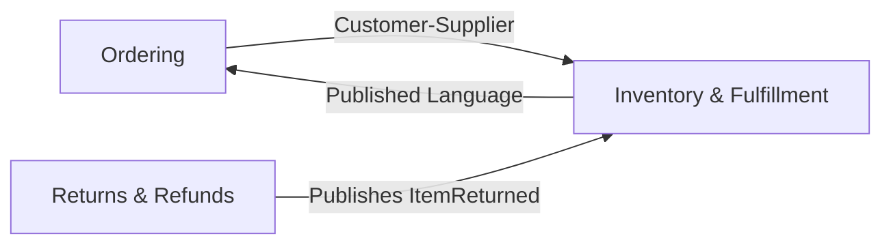

# Inventory & Fulfillment Context — Domain Design

## Overview
The Inventory & Fulfillment context is a **supporting subdomain** responsible for tracking on-hand inventory, reserving stock for orders, routing fulfillment to the right warehouse pool, and managing backorders with a 2-week auto-cancel policy. It receives events from Ordering and publishes inventory availability back via Published Language.

## Ubiquitous Language

| Term | Definition | Notes |
|------|-----------|-------|
| InventoryItem | A SKU with on-hand quantity and active reservations | Not the same as Product in Catalog — here it's purely stock tracking |
| Reservation | A hold on inventory for a specific order | Locked until fulfilled or released |
| FulfillmentOrder | The fulfillment-side representation of an order | Assigned to a pool, tracked through picking/shipping |
| FulfillmentPool | A warehouse or distribution center that can fulfill orders | Has a location and available capacity |
| Backorder | An order waiting for inventory to become available | Subject to 2-week auto-cancel rule |
| SKU | Stock Keeping Unit — the product identifier in inventory terms | Maps to productId in Ordering |
| Quantity | A non-negative amount of stock | Immutable value |
| FulfillmentLocation | Physical address/identifier of a warehouse | Descriptive, interchangeable |
| BackorderDeadline | The calculated expiry date (createdAt + 2 weeks) | Triggers auto-cancellation |
| Available Quantity | On-hand minus reserved | What can still be promised to new orders |

**Polysemous terms:**
- **Product** — Here it's a SKU with quantity. In Catalog it's description/images. In Ordering it's a ProductReference snapshot.
- **Order** — Here it's a FulfillmentOrder (items to pick and ship). In Ordering it's the purchase record.

## Context Relationships

- **Ordering → Inventory**: Customer-Supplier. Ordering sends CheckoutStarted and OrderPlaced. Inventory responds with availability and reservation confirmations.
- **Inventory → Ordering**: Published Language. Inventory publishes events (InventoryReserved, InventoryUnavailable, BackorderAutoCancelled) in a shared schema.
- **Returns → Inventory**: Returns publishes ItemReturned, Inventory restocks.

## Aggregates

### InventoryItem Aggregate
**Root:** InventoryItem
**Purpose:** Tracks on-hand stock for a SKU and manages reservations. Enforces that available quantity (on-hand minus reserved) never goes negative.

**Entities:**
- InventoryItem (root) — the SKU-level stock record
- Reservation — a hold for a specific order

**Value Objects:**
- SKU — product identifier
- Quantity — stock amount

**Invariants:**

| Rule | Condition | On Violation |
|------|-----------|-------------|
| Available quantity cannot go negative | onHand - totalReserved >= 0 | Mark as unavailable, trigger backorder |
| Reservation must reference a valid order | reservation.orderId exists | Reject reservation |
| Cannot reserve more than available | reservationQty <= availableQty | Partial reserve or backorder |

**Domain Events Produced:**
- OnHandInventoryChecked
- InventoryReserved
- InventoryUnavailable
- InventoryRestocked
- ReservationReleased

**Repository Interface:**
- findBySku, findBySkuWithAvailability, save

---

### FulfillmentOrder Aggregate
**Root:** FulfillmentOrder
**Purpose:** Represents an order assigned to a fulfillment pool for picking and shipping. Tracks status from assignment through routing.

**Entities:**
- FulfillmentOrder (root)

**Value Objects:**
- FulfillmentPool — assigned warehouse
- FulfillmentLocation — warehouse address
- Quantity — per line item

**Invariants:**

| Rule | Condition | On Violation |
|------|-----------|-------------|
| Must be assigned to a pool before routing | fulfillmentPool != null | Reject routing |
| Cannot fulfill more than reserved | fulfillQty <= reservedQty | Reject |
| Cannot change pool after routing starts | status != ROUTED | Reject reassignment |

**Domain Events Produced:**
- FulfillmentPoolAssigned
- DirectFulfillmentRouted

**Repository Interface:**
- findById, findByOrderId, save

---

### Backorder Aggregate
**Root:** Backorder
**Purpose:** Tracks orders waiting for inventory. Enforces the 2-week auto-cancel deadline.

**Entities:**
- Backorder (root)

**Value Objects:**
- BackorderDeadline — calculated expiry (createdAt + 14 days)
- SKU — the product awaiting stock
- Quantity — amount needed

**Invariants:**

| Rule | Condition | On Violation |
|------|-----------|-------------|
| Auto-cancel after 2 weeks | now <= backorderDeadline | Trigger BackorderAutoCancelled |
| Cannot backorder an already cancelled order | order.status != CANCELLED | Reject |

**Domain Events Produced:**
- OrderBackordered
- BackorderAutoCancelled

**Repository Interface:**
- findById, findByOrderId, findExpired, save

## Domain Events Catalog

| Event | Producer | Trigger | Payload | Consumers |
|-------|----------|---------|---------|-----------|
| OnHandInventoryChecked | InventoryItem | CheckoutStarted received | sku, availableQty | Ordering |
| InventoryReserved | InventoryItem | Order placed, stock available | orderId, sku, qty, reservationId | Ordering |
| InventoryUnavailable | InventoryItem | Order placed, no stock | orderId, sku, requestedQty | Ordering |
| OrderBackordered | Backorder | Inventory unavailable, backorder created | orderId, sku, backorderDeadline | Ordering, Customer notification |
| BackorderAutoCancelled | Backorder | Scheduler checks deadline exceeded | orderId, sku, backorderId | Ordering, Payment |
| FulfillmentPoolAssigned | FulfillmentOrder | Pool selected for order | orderId, fulfillmentPoolId, location | — |
| DirectFulfillmentRouted | FulfillmentOrder | Fulfillment order sent to warehouse | orderId, fulfillmentPoolId, items | — |
| InventoryRestocked | InventoryItem | Returned item added back | sku, qty, reason | — |
| ReservationReleased | InventoryItem | Order cancelled or backorder expired | orderId, sku, qty | — |

## Domain Services

| Service | Responsibility | Aggregates Involved |
|---------|---------------|-------------------|
| FulfillmentRoutingService | Selects the best fulfillment pool based on location, stock levels, and shipping distance | InventoryItem, FulfillmentOrder |
| BackorderMonitorService | Checks backorder deadlines, triggers auto-cancellation at 2 weeks | Backorder (called by Scheduler) |

## Business Rules Summary

| Rule | Enforced By | Description |
|------|------------|-------------|
| Stock availability gate | InventoryItem | Cannot reserve more than available (on-hand minus existing reservations) |
| Backorder 2-week limit | Backorder + BackorderMonitorService | Orders backordered for > 2 weeks are automatically cancelled |
| Fulfillment pool required | FulfillmentOrder | Cannot route fulfillment without an assigned pool |
| Restock on return | InventoryItem | Returned items are added back to on-hand inventory |
| Release on cancel | InventoryItem | Cancelled orders release their inventory reservations |
