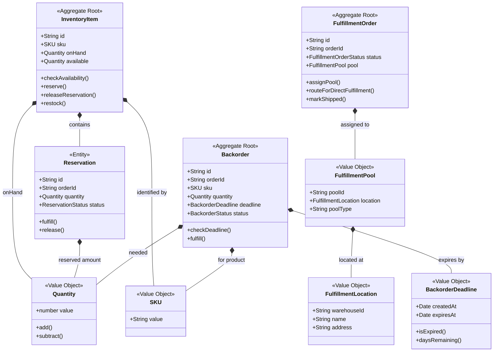
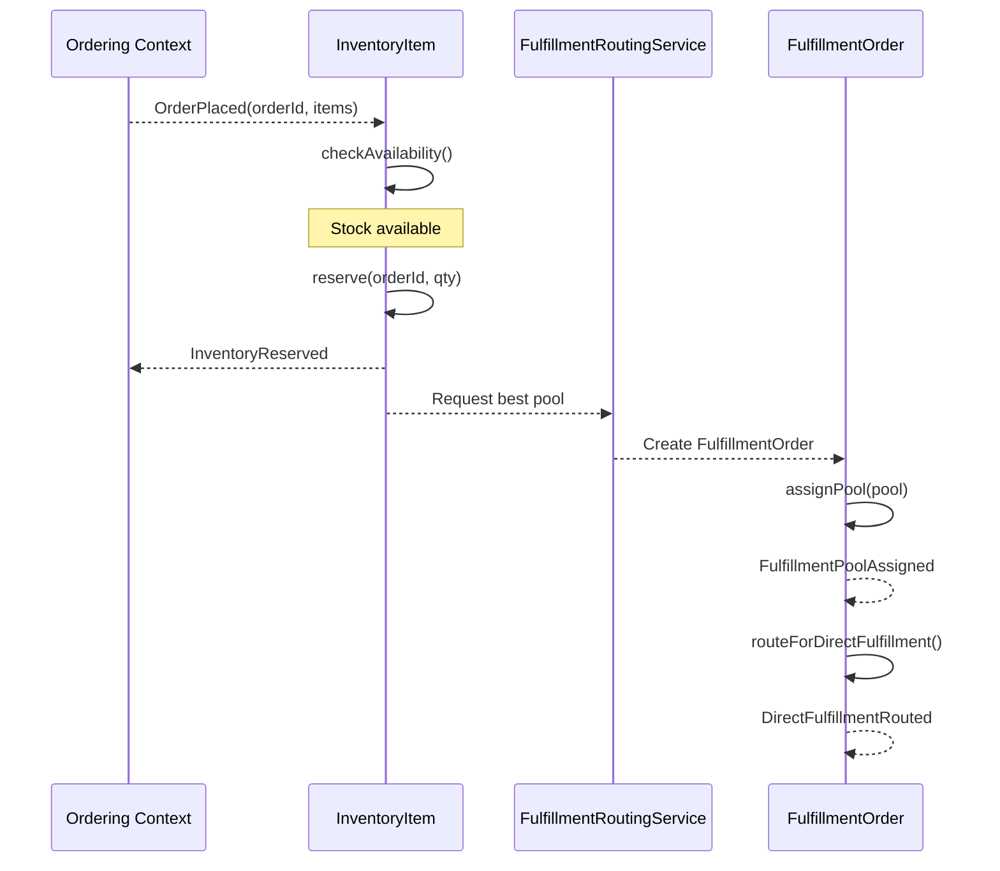
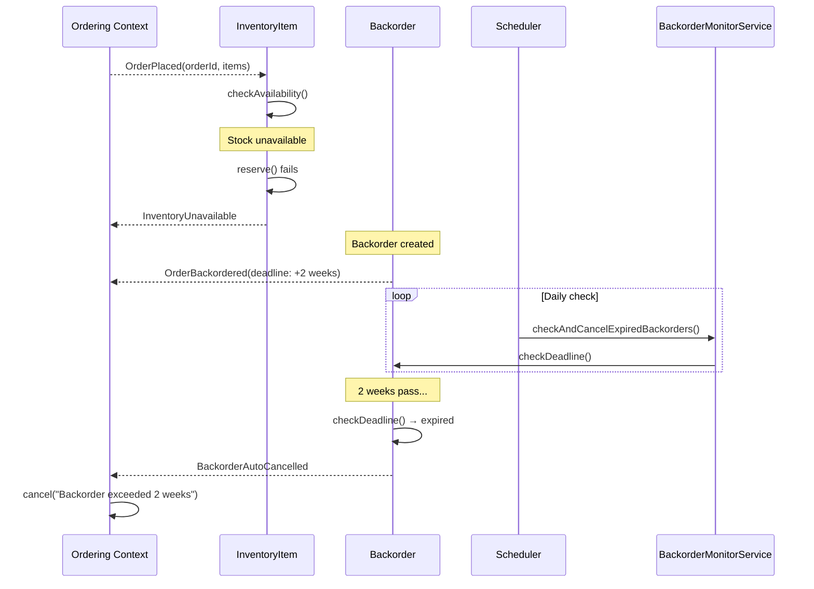
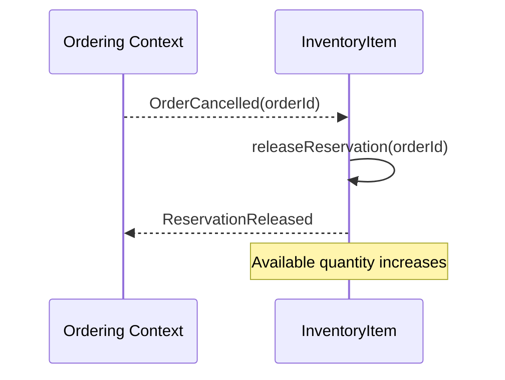
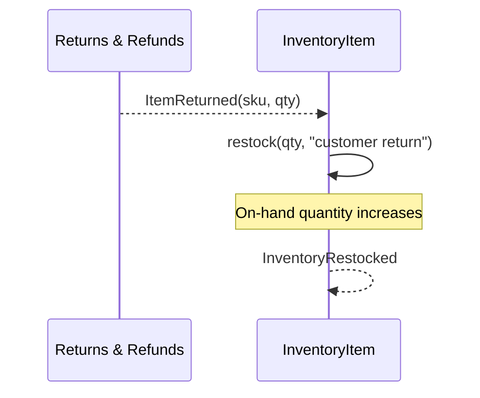

# Inventory & Fulfillment Context — Diagrams

## Aggregate Boundaries

## Event Flow — Happy Path (Order Placed → Fulfilled)

## Event Flow — Backorder Path

## Event Flow — Cancellation Releases Inventory

## Event Flow — Return Restocks Inventory

