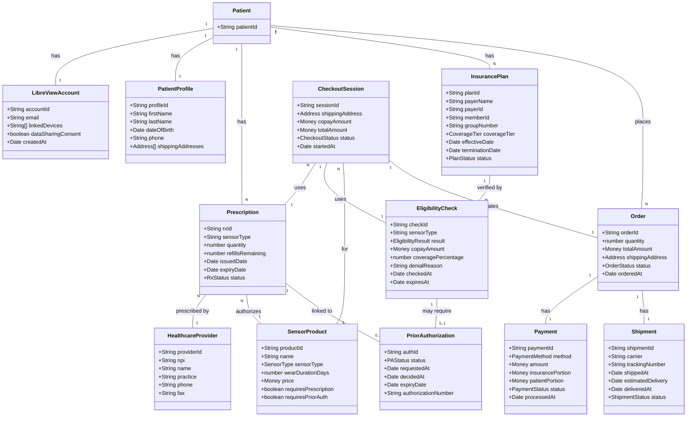
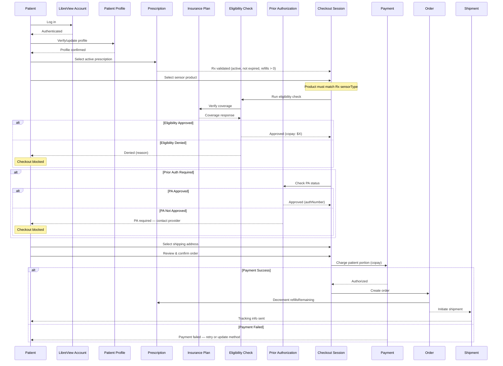
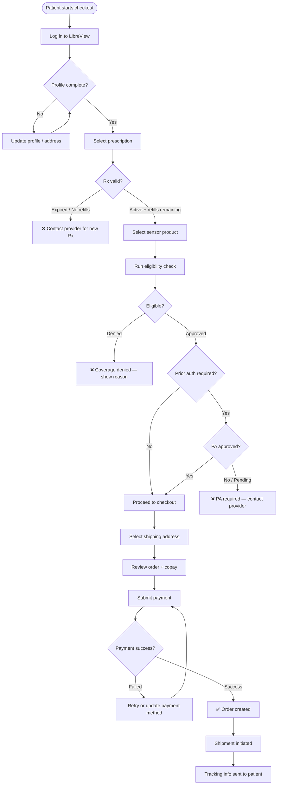
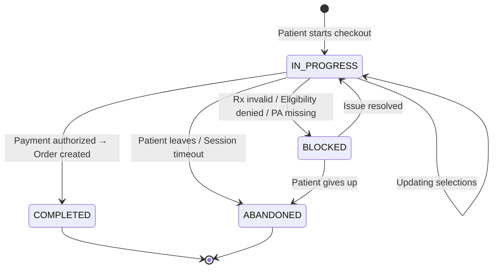
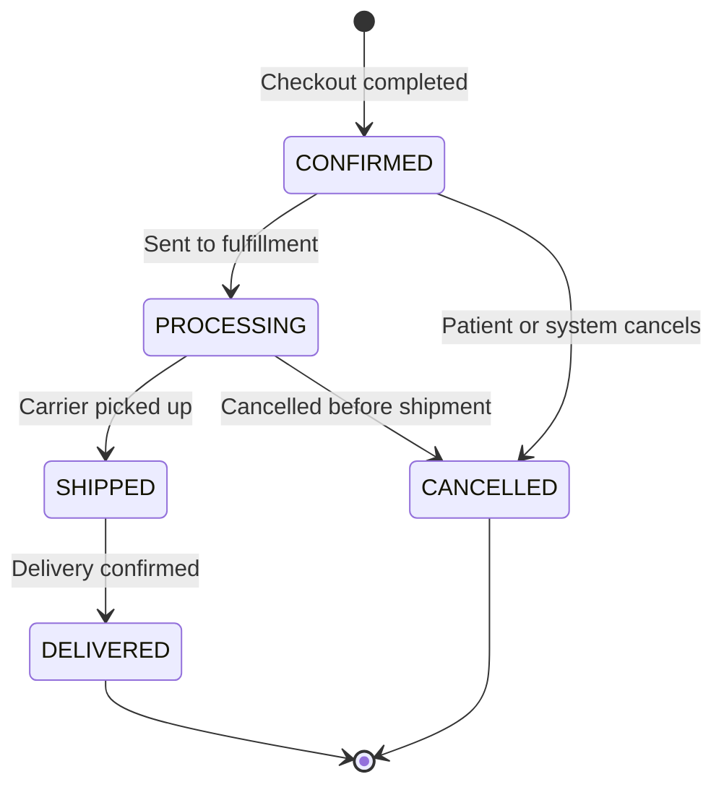

# LibreView Sensor Self-Service Checkout — Diagrams

## Entity Relationship Diagram

## Self-Service Checkout Flow

## Healthcare Gate Diagram

## Entity Lifecycle — Checkout Session States

## Entity Lifecycle — Order States

