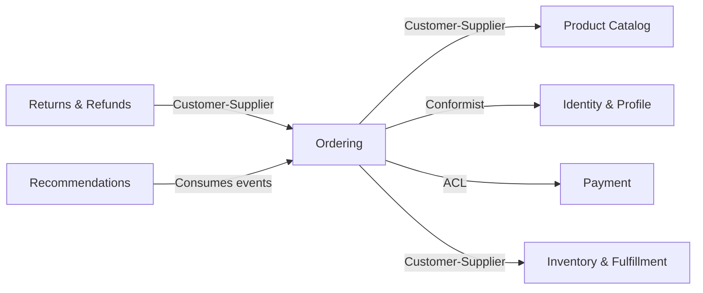

# Ordering Context — Domain Design

## Overview
The Ordering context is the **core domain** of the e-commerce system. It owns the entire buy flow: cart management, eligibility checks, checkout, pricing, and order placement. It holds a lightweight Checkout Profile (snapshot of customer info) rather than owning the full user lifecycle.

## Ubiquitous Language

| Term | Definition | Notes |
|------|-----------|-------|
| Cart | A pre-order collection of items a customer is building | Separate lifecycle from Order |
| CartItem | A specific product + quantity + price within a cart | Identity within the cart only |
| Order | A confirmed purchase with line items, shipping, and pricing | Created when payment is confirmed; immutable after placement |
| OrderLineItem | A specific product + quantity + price within an order | Identity within the order only |
| CheckoutProfile | Lightweight customer snapshot (customerId, name, email, shipping address) | Not the full user — that lives in Identity & Profile |
| ProductReference | Snapshot of product info (productId, name, price) from Catalog | Not the real Product entity — a frozen reference |
| EligibilityCheck | Validation of whether a customer can purchase | Address validation, profile rules |
| PriceBreakdown | Calculated totals: subtotal, tax, shipping cost, discount, total | A snapshot, not a running calculation |
| Discount | A promotional reduction: type, amount, reason | Applied during pricing step |
| Money | An amount + currency pair | Immutable; $29.99 USD |
| ShippingAddress | A delivery destination: street, city, state, zip, country | Must be validated before order placement |

**Polysemous terms (different meaning in other contexts):**
- **Product** — Here it's a ProductReference (frozen snapshot). In Catalog it's the full product with images/categories. In Inventory it's a SKU with quantity.
- **Order** — Here it's an active purchase. In Returns & Refunds it's a completed order being unwound.
- **Address** — Here it's a shipping destination for a specific order. In Identity & Profile it's a saved address in the user's address book.

## Context Map

## Aggregates

### Cart Aggregate
**Root:** Cart
**Purpose:** Manages the pre-order item collection. Enforces eligibility rules and item validity before checkout.

**Entities:**
- Cart (root) — the collection itself, tied to a customer
- CartItem — a product + quantity within the cart

**Value Objects:**
- ProductReference — snapshot of product info from Catalog
- Money — item price
- EligibilityCheck — validation result

**Invariants:**

| Rule | Condition | On Violation |
|------|-----------|-------------|
| Cart must have at least one item to checkout | cartItems.length > 0 | Block checkout |
| Each item must pass eligibility check | eligibility.passed = true | Block item addition, notify customer |
| Quantity must be positive | item.quantity > 0 | Reject update |

**Domain Events Produced:**
- ItemAddedToCart
- ItemRemovedFromCart
- CartUpdated
- EligibilityChecked
- EligibilityRejected
- CheckoutStarted

**Repository Interface:**
- findById, findByCustomerId, save

---

### Order Aggregate
**Root:** Order
**Purpose:** Represents a confirmed purchase. Immutable after placement. Tracks status through its lifecycle.

**Entities:**
- Order (root) — the purchase record with status and totals
- OrderLineItem — a product + quantity + price within the order

**Value Objects:**
- CheckoutProfile — customer snapshot (customerId, name, email, shipping address)
- ShippingAddress — delivery destination
- PriceBreakdown — subtotal, tax, shipping, discount, total
- Discount — promotional reduction
- Money — monetary amounts
- ProductReference — product snapshot

**Invariants:**

| Rule | Condition | On Violation |
|------|-----------|-------------|
| Order must have at least one line item | lineItems.length > 0 | Reject |
| Order total cannot be negative | priceBreakdown.total >= 0 | Recalculate, reject |
| Shipping address must be validated | shippingAddress.validated = true | Block order placement |
| Order cannot be modified after placement | status != PLACED | Reject modification |

**Domain Events Produced:**
- PriceCalculated
- DiscountApplied
- OrderPlaced
- OrderConfirmationSent
- OrderCancelledByCustomer
- OrderCancelledByCSRep

**Repository Interface:**
- findById, findByCustomerId, findByStatus, save, nextId

## Domain Events Catalog

| Event | Producer | Trigger | Payload | Consumers |
|-------|----------|---------|---------|-----------|
| ItemAddedToCart | Cart | Customer adds product | cartId, productId, quantity, price | Recommendations |
| ItemRemovedFromCart | Cart | Customer removes item | cartId, productId | Recommendations |
| CartUpdated | Cart | Quantity change | cartId, items summary | — |
| EligibilityChecked | Cart | Item add or checkout start | cartId, customerId, result, reason | — |
| EligibilityRejected | Cart | Validation fails | cartId, customerId, reason | Identity & Profile |
| CheckoutStarted | Cart | Customer begins checkout | cartId, customerId, items | Inventory & Fulfillment |
| PriceCalculated | Order | Checkout pricing step | orderId, priceBreakdown | — |
| DiscountApplied | Order | Promo or coupon applied | orderId, discount details | — |
| OrderPlaced | Order | Payment confirmed, order created | orderId, customerId, lineItems, shippingAddress, total | Inventory & Fulfillment, Payment, Recommendations |
| OrderConfirmationSent | Order | Order placed policy | orderId, customerId, email | — |
| OrderCancelledByCustomer | Order | Customer cancels | orderId, reason | Inventory & Fulfillment, Payment, Returns & Refunds |
| OrderCancelledByCSRep | Order | CS Rep cancels | orderId, repId, reason | Inventory & Fulfillment, Payment, Returns & Refunds |

## Domain Services

| Service | Responsibility | Aggregates/Contexts Involved |
|---------|---------------|-------------------|
| PricingService | Calculates price breakdown — subtotal, tax, shipping cost, applies discounts | Cart, Order, Product Catalog (for base prices) |
| EligibilityService | Validates whether a customer can purchase — address validation, profile rules | Cart, Identity & Profile (via ACL) |

## Business Rules Summary

| Rule | Enforced By | Description |
|------|------------|-------------|
| Eligibility gate | Cart + EligibilityService | Every item and checkout must pass eligibility (address validation, profile rules) |
| Positive quantity | Cart | Cart items must have quantity > 0 |
| Non-empty cart | Cart | Cannot checkout with an empty cart |
| Validated shipping | Order | Shipping address must be validated before order placement |
| Immutable placed orders | Order | Orders cannot be modified after placement — only cancelled |
| Non-negative total | Order | Order total must be >= 0 |
| Payment before placement | Order (policy) | OrderPlaced only fires after PaymentConfirmed |
