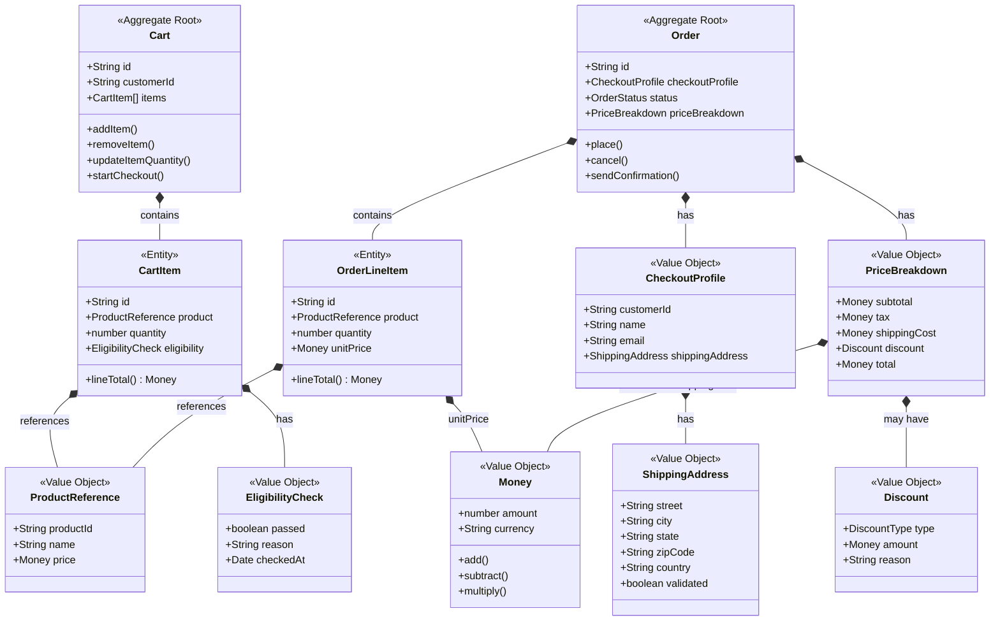
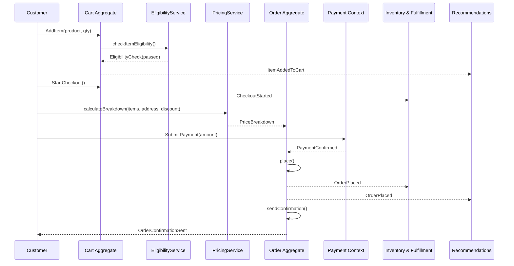
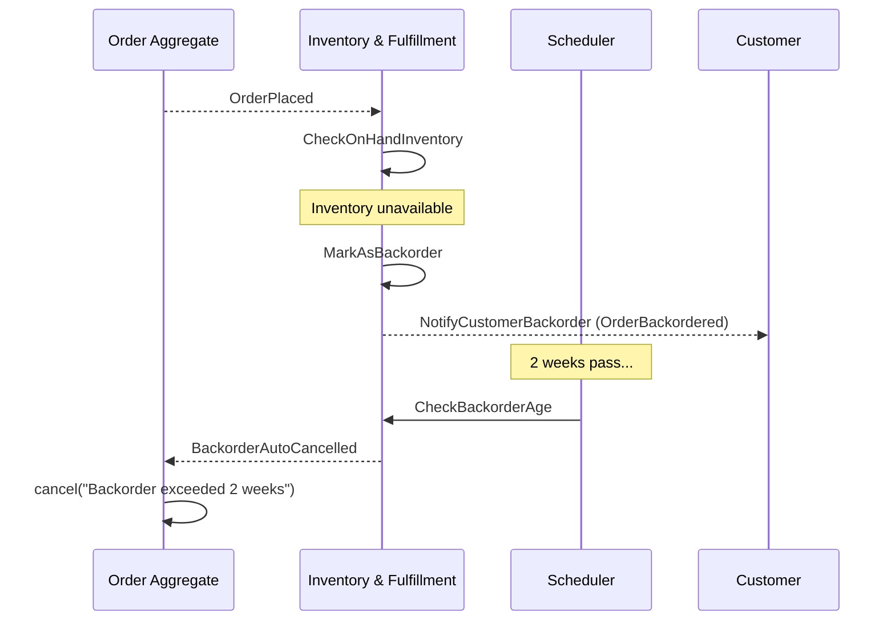
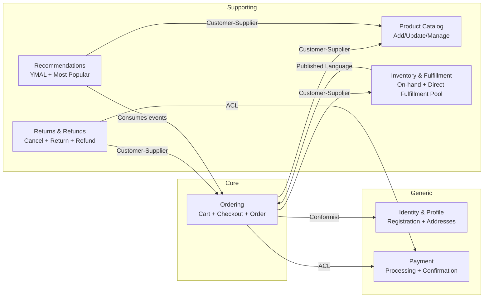

# Ordering Context — Diagrams

## Aggregate Boundaries



## Event Flow — Happy Path (Browse to Confirmation)



## Event Flow — Cancellation

```mermaid
sequenceDiagram
    participant Actor as Customer / CS Rep
    participant Ord as Order Aggregate
    participant Inv as Inventory & Fulfillment
    participant Pay as Payment Context
    participant Ret as Returns & Refunds

    Actor->>Ord: cancel(reason)
    Ord-->>Inv: OrderCancelled
    Ord-->>Pay: OrderCancelled
    Ord-->>Ret: OrderCancelled

    Inv->>Inv: ReleaseInventoryReservation
    Pay->>Ret: IssueRefund
```

## Event Flow — Backorder & Auto-Cancel



## Context Map — Full System


