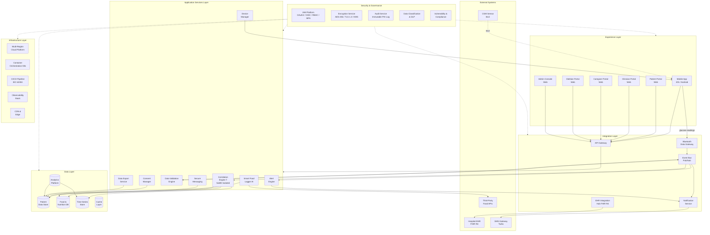
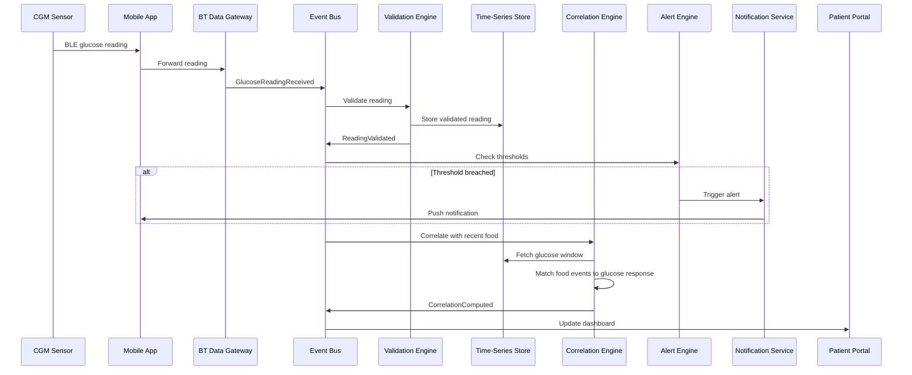
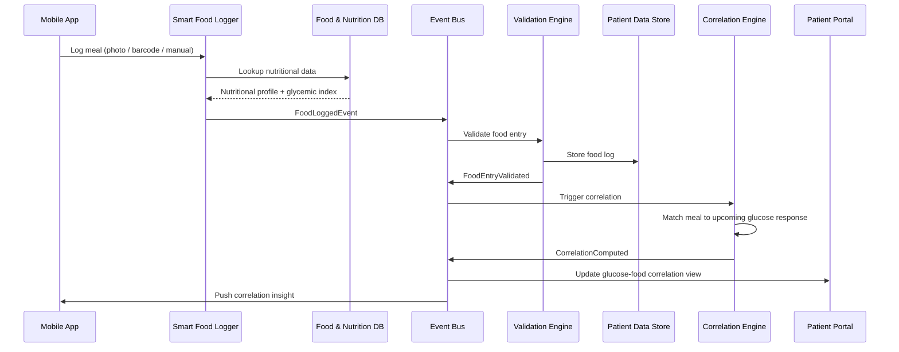
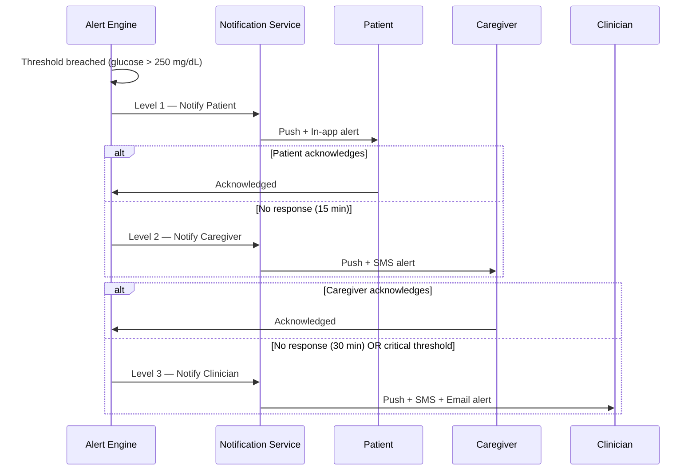
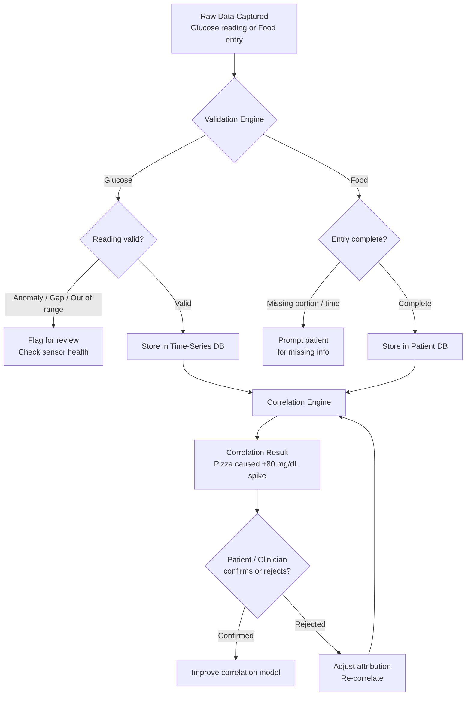
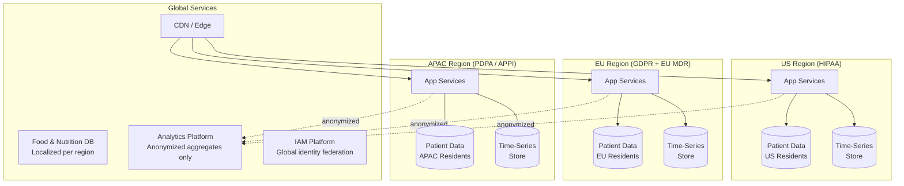

# GlucoSense Connected Platform — Architecture Diagrams

## Notional Architecture — Layered View

## Data Flow — Glucose Reading to Correlation

## Data Flow — Food Logging to Correlation

## Alert Escalation Flow

## Closed Loop Validation Flow

## Multi-Region Deployment

