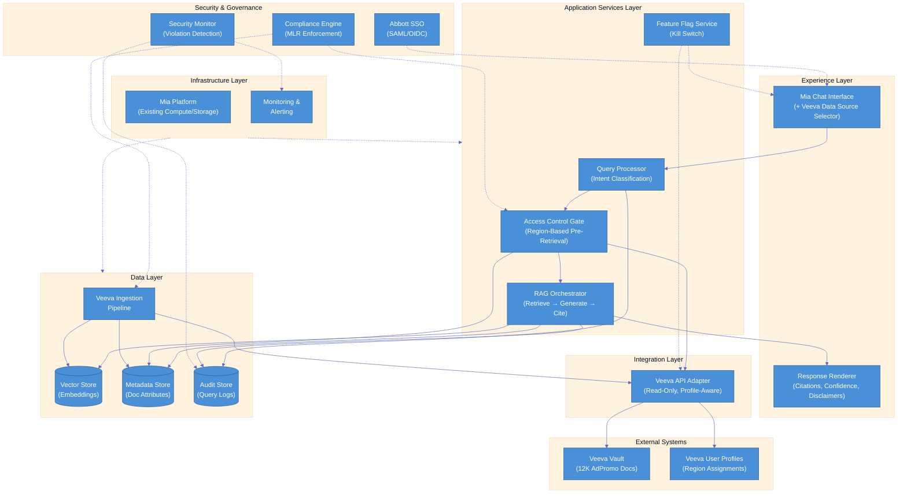

# Veeva-Mia Integration — Notional Architecture

## Strategic Context

### Vision
Digital workplace transformation — Sales reps self-serve approved marketing content through conversational AI (Mia), eliminating Marketing as a bottleneck for content requests.

### Mission
Integrate Veeva's 12,000 AdPromo-approved documents into Mia with region-based access control, enabling conversational retrieval at query time. Backend integration with minimal frontend change.

### Current State Pain Points
1. **1 hour per material search** — Sales reps navigate 12K docs manually in Veeva without intelligent filtering
2. **Missed customer opportunities** — Slow retrieval means reps go into HCP meetings without the right materials
3. **Marketing bottleneck** — Marketing fields constant content requests that could be self-served
4. **MLR accuracy risk** — "System chat must not give wrong data from wrong file" — accuracy critical for compliance

### Value Proposition
- 75% reduction in search time (1 hour to 15 minutes)
- Conversational self-service in existing Mia workflow
- No new systems or user learning curve (reuses SharePoint chat pattern)
- MLR compliance preserved via pre-retrieval access control

### Outcomes Expected
| Metric | Baseline | At Launch | 90 Days |
|---|---|---|---|
| Time to find material | 1 hour | 35 min (42% reduction) | 15 min (75% reduction) |
| Response time (P95) | 45 seconds | 30 seconds | 30 seconds |
| Access violations | 0/month | 0/month | 0/month |
| Negative UAT feedback | — | <25% (kill if exceeded) | <10% |

**Kill Criteria** (any triggers immediate rollback within 30 days of pilot):
- Access violation detected (Sales rep sees non-assigned region doc)
- Response time >60s P95 sustained 48hrs
- Negative UAT feedback >25%

### Success Drivers
1. Reuse existing infrastructure — Mia Chat UX, Veeva API, Abbott SSO
2. Metadata-driven ingestion following existing Mia pipeline pattern
3. Access enforcement before retrieval (not at display) — MLR compliance
4. Feature flag kill switch with <15 minute rollback
5. Pilot-first rollout (10 users USA -> global)

### Regional Contexts
- **Scope**: Global (pilot: USA, scale: all regions)
- **Access Control**: Region-based via Veeva user profile region assignments
- **Compliance**: MLR — only "approved for distribution" documents, published to Core Diagnostics Library portal
- **Privacy**: Never reveal whether content exists when access is denied (generic message)
- **Division**: Diagnostics | Business Unit: Core Lab Diagnostics
- **Materials**: AdPromo only (Diagnostics Materials document type)
- **Formats**: PDF, PPT, DOC, audio, video, JPEG

## Actor Journeys

### Journey 1: Sales Rep Finds Marketing Materials (Happy Path)
1. Sales rep opens Mia, selects "Veeva" data source
2. Enters natural language query (e.g., "Alinity-S marketing material for HCPs in Albania")
3. System classifies query intent (product info, regulatory, customer objection, usage/expansion, doc search)
4. System checks user's assigned regions via Veeva profile
5. System retrieves relevant docs — filtered by region access + approval status + unexpired
6. System generates conversational response synthesizing content
7. Response includes citations: doc ID, title, approval date, region, link + usage disclaimer (internal vs customer-facing)
8. System displays confidence level (high/medium/low)
9. All activity logged to audit trail

### Journey 2: Sales Rep — Access Denied / Not Found
1. Sales rep queries for materials in a region they don't have access to (or materials don't exist)
2. System checks region access — fails
3. System returns generic message: "No document found. This could be due to various reasons: document doesn't exist in Veeva, you don't have access to documents in that region, or materials are not yet published to the portal."
4. System does NOT reveal whether content exists but user lacks access vs content doesn't exist (privacy)
5. Activity logged to audit trail

### Journey 3: Marketing — Metadata Management (Admin)
1. Marketing team (Abir/CoreDX) defines and aligns metadata tags in Veeva
2. Ingestion pipeline picks up metadata changes on next sync
3. Marketing has global access — can verify content appears correctly across all regions

## Journey Experience Matrix

| Journey Stage | Mia Chat Interface | Response Renderer | Query Processor | Access Control Gate | RAG Orchestrator | Feature Flag Service | Veeva API Adapter | Vector Store | Metadata Store | Audit Store | Ingestion Pipeline | Compliance Engine | Security Monitor |
|---|:---:|:---:|:---:|:---:|:---:|:---:|:---:|:---:|:---:|:---:|:---:|:---:|:---:|
| **J1: Select data source** | X | | | | | X | | | | | | | |
| **J1: Enter query** | X | | X | | | | | | | | | | |
| **J1: Check region access** | | | | X | | | X | | X | | | X | |
| **J1: Retrieve docs** | | | | | X | | | X | X | | | | |
| **J1: Generate response** | | X | | | X | | | | | | | | |
| **J1: Display citations** | | X | | | | | | | X | | | | |
| **J1: Log activity** | | | | | | | | | | X | | | X |
| **J2: Access denied** | | X | | X | | | X | | | X | | X | |
| **J3: Manage metadata** | | | | | | | | | X | | X | | |

## Capability-to-Enabler-to-Component Mapping

| Business Capability | Category | Technical Enabler | Component | Layer |
|---|---|---|---|---|
| Conversational chat with data source selection | Experience | Existing Mia Chat UX (SharePoint pattern) | **Mia Chat Interface** | Experience |
| Citation display + confidence framing + disclaimers | Experience | Rich response renderer | **Response Renderer** | Experience |
| Query intent classification | Process | LLM-based NLP classifier | **Query Processor** | Application Services |
| Region-based access enforcement (pre-retrieval) | Process | Policy engine with Veeva profile lookup | **Access Control Gate** | Application Services |
| Retrieval + generation + citation + confidence scoring | Process | RAG pipeline (retrieve -> filter -> generate -> cite) | **RAG Orchestrator** | Application Services |
| Kill switch (<15 min rollback) | Process | Feature flag toggle | **Feature Flag Service** | Application Services |
| Metadata-driven document ingestion | Data | ETL pipeline (existing Mia pattern) | **Veeva Ingestion Pipeline** | Data |
| Semantic search over 12K documents | Data | Vector database + embedding model | **Vector Store** | Data |
| Document metadata (status, region, approval, expiry, version) | Data | Metadata database | **Metadata Store** | Data |
| Audit trail (user ID, query, docs accessed, timestamp) | Data | Audit log database | **Audit Store** | Data |
| Veeva API access (read-only, profile-aware) + user profile sync | Integration | REST API adapter with circuit breaker | **Veeva API Adapter** | Integration |
| SSO authentication | Platform | SAML/OIDC federation (existing Abbott SSO) | **Abbott SSO** | Security & Governance |
| MLR compliance enforcement (doc status + approval gate) | Platform | Compliance rules engine | **Compliance Engine** | Security & Governance |
| Access violation detection + daily scan + alerting | Platform | Monitoring + automated scan | **Security Monitor** | Security & Governance |

## Architecture Layers

### Experience Layer
Minimal changes to existing Mia frontend. The data source selector gains a "Veeva" option. The response renderer handles Veeva-specific citation formatting (doc ID, approval date, region, usage disclaimers) and confidence-level framing.

### Integration Layer
A single new adapter connects Mia to Veeva's API. It handles two concerns: (1) document content and metadata retrieval for ingestion, and (2) real-time user profile lookup for region assignments. Read-only by design. Profile-aware — adapts behavior based on the calling user's Veeva identity.

### Application Services Layer
Four services handle the query lifecycle:
- **Query Processor** classifies intent to optimize retrieval strategy
- **Access Control Gate** enforces region-based filtering BEFORE any retrieval occurs (MLR compliance requirement — rejected alternative was "filter at display")
- **RAG Orchestrator** manages the full pipeline: embed query -> vector search -> metadata filter -> LLM generation -> citation assembly -> confidence scoring
- **Feature Flag Service** provides the kill switch — Aaron can disable Veeva integration in <15 minutes with no deployment

### Data Layer
- **Veeva Ingestion Pipeline** follows the existing Mia SharePoint connector pattern. Metadata-driven: only ingests documents with status "approved for distribution" published to Core Diagnostics Library portal. Initial load: ~6 days at 2,000 docs/day for 12K documents. Filters by status, region, publish-to-portal.
- **Vector Store** holds embeddings for semantic search. Updated incrementally as new docs are approved in Veeva.
- **Metadata Store** tracks document attributes: status, region, category, approval date, expiry, version, doc ID. Used by Access Control Gate and citation engine.
- **Audit Store** logs every query and document access with user ID, timestamp, query text, and documents returned. Supports automated daily scan for access violations.

### Infrastructure Layer
Leverages existing Mia platform infrastructure. Aaron is assessing whether additional compute/storage capacity is needed for the 12K document corpus (3-month ramp-up planned). No new infrastructure systems required.

### Security & Governance (Cross-Cutting)
- **Abbott SSO** — existing, confirmed. No new identity infrastructure.
- **Compliance Engine** — enforces MLR rules: only approved-for-distribution documents, only within user's assigned regions, never surface unapproved/expired/draft content. Enforced at retrieval time, not display time.
- **Security Monitor** — automated daily scan of audit logs for access violations. Alerts to Cyber Security + Aaron. Any violation triggers immediate rollback per kill criteria.

## Architecture Diagram

## Component Descriptions

| Component | Layer | Description | Capabilities Enabled |
|---|---|---|---|
| **Mia Chat Interface** | Experience | Existing Mia conversational UI with new "Veeva" option in data source selector. Minimal frontend change. | Conversational chat, data source selection |
| **Response Renderer** | Experience | Formats RAG output with Veeva-specific citations (doc ID, title, approval date, region, link), usage disclaimers (internal vs customer-facing), and confidence-level framing (high/medium/low). | Citation display, confidence framing, disclaimer presentation |
| **Query Processor** | Application Services | LLM-based classifier that categorizes user queries by intent: product info, regulatory, customer objection, usage/expansion, doc search. Optimizes retrieval strategy based on intent. | Query intent classification |
| **Access Control Gate** | Application Services | Policy engine that enforces region-based access BEFORE any document retrieval. Looks up user's assigned regions via Veeva API Adapter, filters query scope to permitted regions only. Returns generic "not found" message on denial (never reveals content existence). | Region-based access enforcement, MLR compliance, privacy |
| **RAG Orchestrator** | Application Services | Core processing pipeline: (1) embed query, (2) vector search against doc corpus, (3) filter by metadata (status, region, expiry), (4) generate conversational response via LLM, (5) assemble citations with doc IDs and disclaimers, (6) score confidence (high/medium/low). | Retrieval, generation, citation, confidence scoring |
| **Feature Flag Service** | Application Services | Toggle that enables/disables Veeva data source. Kill switch: Aaron can disable in <15 minutes with no deployment required. Reverts Mia to SharePoint-only mode. | Kill switch, phased rollout |
| **Veeva API Adapter** | Integration | Read-only REST adapter connecting Mia to Veeva Vault. Two functions: (1) bulk document + metadata retrieval for ingestion pipeline, (2) real-time user profile lookup for region assignments. Profile-aware with circuit breaker for resilience. | Veeva document access, user profile sync |
| **Veeva Ingestion Pipeline** | Data | Metadata-driven ETL following existing Mia SharePoint connector pattern. Filters: only "approved for distribution" + published to Core Diagnostics Library portal. Initial load: ~6 days at 2K docs/day. Incremental sync for new/updated/expired docs. | Document ingestion, metadata filtering |
| **Vector Store** | Data | Vector database holding document embeddings for semantic search. Populated by ingestion pipeline. Queried by RAG Orchestrator during retrieval. | Semantic search over 12K documents |
| **Metadata Store** | Data | Database tracking document attributes: status, region, category, approval date, expiry date, version, doc ID, publish-to-portal flag. Used by Access Control Gate (region filtering), RAG Orchestrator (metadata filtering), and Response Renderer (citations). | Document metadata, access control data, citation data |
| **Audit Store** | Data | Append-only log of all queries and document accesses: user ID, timestamp, query text, docs returned, access decisions. Scanned daily by Security Monitor. Supports kill criteria evaluation and compliance reporting. | Audit trail, violation detection, compliance reporting |
| **Abbott SSO** | Security & Governance | Existing SAML/OIDC federation. Authenticates users entering Mia. No new identity infrastructure required. | Authentication |
| **Compliance Engine** | Security & Governance | Rules engine enforcing MLR compliance: (1) only approved-for-distribution docs ingested, (2) region access enforced pre-retrieval, (3) expired/draft/unapproved content excluded, (4) no off-label or unapproved indication content generated. | MLR compliance, document status enforcement |
| **Security Monitor** | Security & Governance | Automated daily scan of audit logs for access violations (cross-region leakage). Alerts Cyber Security + Aaron. Any violation triggers immediate rollback per kill criteria. Integrates with existing Mia monitoring infrastructure. | Access violation detection, alerting, compliance monitoring |

## Journey-to-Component Traceability

| Journey | Stage | Components Involved |
|---|---|---|
| **Sales Rep — Find Materials** | Select Veeva data source | Mia Chat Interface, Feature Flag Service |
| | Enter natural language query | Mia Chat Interface, Query Processor |
| | Classify query intent | Query Processor |
| | Check region access | Access Control Gate, Veeva API Adapter, Metadata Store, Compliance Engine |
| | Retrieve relevant documents | RAG Orchestrator, Vector Store, Metadata Store |
| | Generate conversational response | RAG Orchestrator |
| | Display with citations + confidence | Response Renderer, Mia Chat Interface |
| | Log activity | Audit Store, Security Monitor |
| **Sales Rep — Access Denied** | Enter query | Mia Chat Interface, Query Processor |
| | Region check fails | Access Control Gate, Veeva API Adapter, Compliance Engine |
| | Return generic message (privacy) | Response Renderer |
| | Log denial | Audit Store |
| **Marketing — Metadata Mgmt** | Define/align metadata tags | Metadata Store (via Veeva admin) |
| | Ingestion picks up changes | Veeva Ingestion Pipeline, Veeva API Adapter |
| | Verify content across regions | Mia Chat Interface (Marketing has global access) |

## Cross-Cutting Concerns

### Security
- **Authentication**: Abbott SSO (existing SAML/OIDC) — no new identity systems
- **Authorization**: Region-based access control enforced at query time BEFORE retrieval. User's assigned regions looked up from Veeva user profile API. Access denied returns generic message — never reveals content existence (privacy requirement)
- **Audit**: Every query and document access logged with user ID, timestamp, and full context. Daily automated scan for violations.
- **Kill switch**: Feature flag disables Veeva integration in <15 minutes. Reverts to SharePoint-only mode with no functionality loss.

### Governance
- **MLR Compliance**: Only documents with "approved for distribution" status and published to Core Diagnostics Library portal are ingested. Expired documents excluded. No clinical claims beyond MLR-approved materials. No off-label use or unapproved indications.
- **Read-only integration**: No write-back to Veeva. No document modification. Content integrity preserved.
- **Audit trail**: Full traceability of all queries and access decisions for compliance reporting.

### Regional Requirements
- **Pilot**: USA (10 users, 30-day evaluation) before global rollout
- **Region-based access**: Sales reps see only documents approved for their assigned regions. Marketing has global access.
- **Data flow**: All data stays within existing Mia platform infrastructure. Document content ingested from Veeva and stored in Mia's vector store and metadata store.
- **Privacy**: Access denied responses never distinguish between "content doesn't exist" and "you don't have access" — generic message protects content existence from unauthorized users.

## Dependencies & Risks

### Dependencies
| Dependency | Owner | Status |
|---|---|---|
| Veeva API access (read-only, sandbox) | Veeva Platform Team | Confirmed |
| SSO authentication | Network Team | Confirmed (existing) |
| User profile data sync (regions) | Veeva API | Confirmed (available) |
| Metadata tag alignment | Abir (CoreDX Marketing) | In progress (30-day timeline) |
| Abbott-Veeva Platform Team approval | Platform owner | Alignment planned |
| Mia platform capacity + ingestion | Aaron, Jinesh, Jayaraj | Planned (3-month lead time) |

### Top Risks
| Risk | Likelihood | Impact | Mitigation |
|---|---|---|---|
| Veeva Platform Team deprioritizes support | Medium | High | Alignment meetings using PRD, escalation path |
| Access control logic fails (cross-region leakage) | Low | High | Tech spikes with Veeva engineers, comprehensive UAT, automated validation |
| Response accuracy drops vs SharePoint baseline | Medium | Medium | Diverse query testing pre-launch, pilot validates accuracy, feedback threshold |
| Sales reps don't adopt | Low | Medium | Training, demo videos, pilot champions, time savings messaging |

## Rollout Phases
| Phase | Timeline | Gate |
|---|---|---|
| Platform readiness (API, metadata, infra, UAT) | Q2 2026 | Metadata filtering validated, access control validated, <10% negative UAT |
| Pilot (10 users, USA, 30 days) | Q3 2026 | Time savings >=40%, zero access violations, <10% negative feedback |
| Global rollout (all Core Lab Diagnostics, phased by region) | Q4 2026 | Stakeholder sign-off: Sheena, Aaron, Abir, Platform Team |
