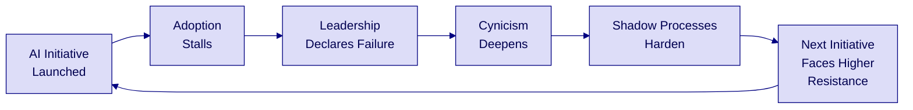

# The Hidden Balance Sheet
# Why AI Initiatives Fail and What Cultural Debt Costs You

*A case for treating culture as infrastructure — not afterthought*

---

## Metadata
- **Audience**: C-suite, VPs, Engineering Leadership, Board
- **Duration**: 15 minutes (expandable to 30 with appendix)
- **Outcome Sought**: Awareness and alignment — recognize cultural debt as the primary driver of AI failure
- **Date**: April 2026
- **Brand**: Abbott BTS-DTS

Proprietary and confidential — do not distribute

---

## Executive Summary

AI initiatives fail at a rate of 70-85% — and technology is rarely the cause. The root cause is **cultural debt**: the accumulated resistance, misaligned incentives, and eroded trust that grow with every failed attempt. Unlike technical debt, no one tracks it, no one budgets for it, and it compounds quarterly.

| **The Problem** | **The Hidden Cost** | **The Path Forward** |
|---|---|---|
| **70-85%** | **3x** | **Culture before code** |
| AI initiative failure rate across industries | Higher failure rate on second attempt when cultural debt is unaddressed | Organizations that invest in cultural readiness before technology see 2-3x higher adoption |
| **What's failing** | **What's compounding** | **What works** |
| Not the models, not the data, not the platforms — the organization itself | Each failure breeds cynicism, shadow processes, and passive resistance that poison the next initiative | Psychological safety, aligned incentives, and visible leadership commitment — applied before the first sprint |

*Sources: McKinsey Global Institute (2023); Gartner AI in the Enterprise Survey (2024); MIT CISR Digital Transformation Research (2024)*

**Speaker Notes**: This is the entire deck in one slide. If you lose the room after this, the core message still landed. Pause here — ask if the failure rate surprises anyone. It usually doesn't, which proves the point: everyone knows AI initiatives fail, yet organizations keep treating it as a technology problem.

Proprietary and confidential — do not distribute

---

## Slide 1: 70-85% of AI Initiatives Fail — Technology Isn't the Reason

The industry treats AI failure as a technical problem. The data says otherwise.

| | | | |
|---|---|---|---|
| **70-85%** | **< 15%** | **#1** | **$4.6T** |
| **AI initiatives that fail to deliver expected value** | **Failures attributed to technology limitations** | **Reason cited: organizational and cultural resistance** | **Projected global AI investment by 2027** |
| Consistent across industries, company sizes, and geographies | Models work. Infrastructure works. The organization doesn't adopt. | Change resistance, skill gaps, misaligned incentives, lack of trust | The majority at risk of delivering no return |

*Sources: McKinsey (2023); BCG AI Adoption Survey (2024); IDC Worldwide AI Spending Guide (2025)*

**Speaker Notes**: The shock isn't the failure rate — most leaders already sense it. The shock is how little of it traces back to technology. Ask the room: "How many of you have seen an AI pilot succeed technically but fail organizationally?" You'll get nods. That's cultural debt in action.

Proprietary and confidential — do not distribute

---

## Slide 2: Cultural Debt Compounds Like Technical Debt — But No One Tracks It

| **Technical Debt** | **Cultural Debt** |
|---|---|
| Shortcuts in code that create future rework | Shortcuts in change management that create future resistance |
| Visible in code reviews, build times, bug rates | Invisible until the next initiative stalls |
| Tracked, measured, budgeted for | Untracked, unmeasured, unbudgeted |
| Compounds as system complexity grows | Compounds as organizational cynicism grows |
| Fix: refactor the code | Fix: rebuild trust, realign incentives, invest in people |

*Cultural debt accrues every time an organization deploys technology without investing in the humans who must adopt it.*

**Speaker Notes**: Technical debt is a concept every engineering leader understands. Cultural debt is the organizational equivalent — but it has no dashboard, no Jira ticket, and no sprint to pay it down. The comparison lands because it reframes something abstract (culture) in terms they already budget for (debt). Pause on "untracked, unmeasured, unbudgeted" — that's the core insight.

Proprietary and confidential — do not distribute

---

## Slide 3: Every Failed AI Initiative Makes the Next One Harder

**The Compounding Cycle:**
- **Cycle 1**: Healthy skepticism — "Let's see if this works"
- **Cycle 2**: Active resistance — "We tried this before"
- **Cycle 3**: Organizational antibodies — "AI doesn't work here"
- **Cycle 4**: Structural inability — the best people have stopped engaging

**Speaker Notes**: Walk through the cycle slowly. Each loop isn't just a repeat — it's worse. By cycle 3, the resistance isn't even conscious. People have built workarounds, informal processes, and narratives that make AI adoption structurally impossible. The phrase "organizational antibodies" resonates with biotech and healthcare audiences — the organization literally develops an immune response to AI.

Proprietary and confidential — do not distribute

---

## Slide 4: Five Cultural Patterns Predict AI Failure Before Launch

| **Pattern** | **What It Looks Like** | **What It Costs** |
|---|---|---|
| **Permission Culture** | Teams wait for approval before experimenting | Innovation dies in committee; competitors move faster |
| **Metric Misalignment** | AI success measured by deployment, not adoption | Teams ship models no one uses; declare victory anyway |
| **Invisible Middle** | Middle management neither sponsors nor blocks — they wait | Initiatives lose momentum in the layer that controls execution |
| **Skills Theater** | Training programs check boxes but don't build capability | Teams attend workshops, return to old workflows Monday morning |
| **Trust Deficit** | "AI will replace us" narrative goes unaddressed | Best talent disengages or leaves; adoption becomes coercion |

**Speaker Notes**: These five patterns are diagnostic — if even two are present, the initiative is at risk before a single model is trained. Ask the audience to mentally score their organization. You won't need to tell them the result — their expression will show it. The "Invisible Middle" pattern is the least discussed and often the most lethal. Middle managers aren't resisting — they're rationally waiting to see which way leadership actually commits.

Proprietary and confidential — do not distribute

---

## Slide 5: Organizations That Break the Cycle Invest in Culture Before Code

| **What They Do** | **Why It Works** | **Evidence** |
|---|---|---|
| **Psychological safety first** — create space for experimentation and failure | People adopt what they help build; fear of failure kills adoption faster than bad technology | Google's Project Aristotle: psychological safety is the #1 predictor of team effectiveness |
| **Aligned incentives** — measure adoption and impact, not deployment | What gets measured gets done; if the metric is "model deployed" nobody owns adoption | Microsoft AI transformation: shifted KPIs from deployment to business outcome — adoption jumped 40% |
| **Visible leadership commitment** — leaders use the tools publicly, share failures openly | Permission flows downward; if the VP doesn't use it, the team won't either | MIT CISR: executive engagement is the strongest predictor of digital transformation success |

**Speaker Notes**: This is the "what works" slide — the turn from problem to solution. These three traits aren't aspirational — they're observable in every successful AI transformation. Psychological safety sounds soft until you realize it's the difference between teams who experiment and teams who hide. Aligned incentives sounds obvious until you audit how many AI programs still measure "models in production" rather than "decisions improved."

Proprietary and confidential — do not distribute

---

## Slide 6: The Shift Requires People, Process, and Technology — In That Order

**Most organizations invest in reverse order. That sequence is the source of cultural debt.**

| **People** | **Process** | **Technology** |
|---|---|---|
| **From: AI as threat → To: AI as multiplier** | **From: Deploy then adopt → To: Co-design then deploy** | **From: Build it and they will come → To: Build what they asked for** |
| Invest in capability, not just training. Redefine roles around Human + AI collaboration. Make experimentation safe. | Embed adoption into the delivery process — not as a phase after launch. Measure outcomes, not outputs. | Choose platforms that meet people where they are. Reduce friction. Integrate into existing workflows. |
| **From: Skills theater → To: Apprenticeship** | **From: IT-led → To: Business-led, IT-enabled** | **From: Centralized tools → To: Contextual guardrails** |
| Pair practitioners with AI. Learn by doing, not by slide deck. Build internal multipliers — not just external consultants. | Business owns the problem and the outcome. Technology teams enable, not dictate. | Responsible AI guardrails embedded at the platform level. Teams focus on value, not compliance paperwork. |

**Transition Plan** — Start with People (Q1) | Redesign Process around adoption (Q2) | Then select and deploy Technology (Q3)

**Speaker Notes**: This slide reframes the investment sequence. Almost every failed AI initiative started with technology selection. The ones that succeed start with people. The "From → To" framing lets the audience self-diagnose — they'll see their organization in the left column. Don't rush through this. Let them sit with the discomfort.

Proprietary and confidential — do not distribute

---

## Slide 7: Cultural Debt Grows Quarterly — Every Delay Compounds the Cost

| | | | |
|---|---|---|---|
| **Quarter 1** | **Quarter 2** | **Quarter 4** | **Year 2** |
| **Skepticism** | **Resistance** | **Antibodies** | **Structural Lock-in** |
| "Let's wait and see" | "This didn't work last time" | "AI isn't for us" | The best people stopped engaging |
| *Low cost to address* | *Moderate cost* | *High cost — requires visible reset* | *Requires organizational redesign* |

**The math is simple**: addressing cultural debt in Q1 costs a leadership conversation. Addressing it in Year 2 costs a transformation program.

**Speaker Notes**: This is the urgency slide. The compounding metaphor works because leadership thinks in financial terms. Frame it as: "Every quarter cultural debt goes unaddressed, the cost to fix it roughly doubles — not because the problem gets harder, but because the cynicism gets deeper." If the audience is finance-oriented, draw the analogy to interest payments on real debt. You're not paying it down, so you're paying more to service it.

Proprietary and confidential — do not distribute

---

## Slide 8: Three Actions to Start Paying Down Cultural Debt Today

| **Action** | **Who Owns It** | **First 30 Days** |
|---|---|---|
| **Audit the cultural balance sheet** — Run a cultural readiness assessment before the next AI investment. Name the debt. | Executive Sponsor + HR | Survey team sentiment on AI. Map the last 3 failed initiatives. Identify the patterns from Slide 4. |
| **Realign the scorecard** — Change how you measure AI success from "deployed" to "adopted and delivering value" | Business Unit Leads | Rewrite the KPIs for the current AI portfolio. Add adoption and outcome metrics. Remove vanity deployment metrics. |
| **Make leadership visible** — Executives use the tools, share what they learned, and admit what didn't work | C-Suite | One executive shares an AI experiment (success or failure) in the next all-hands. Publicly. |

**Speaker Notes**: End with action, not inspiration. These three are deliberately low-cost and high-signal. The cultural audit names the problem — organizations can't fix what they don't measure. The scorecard realignment changes behavior overnight — teams optimize for whatever the metric says. Visible leadership is the permission structure — until the C-suite models the behavior, everything else is policy without practice.

Proprietary and confidential — do not distribute

---

## Next Steps

| **Action** | **Owner** | **By When** |
|---|---|---|
| Circulate this deck and the cultural debt framework to leadership team | [Presenter] | This week |
| Run cultural readiness assessment on current AI portfolio | [Executive Sponsor] + HR | Within 30 days |
| Audit AI program KPIs — flag any that measure deployment without adoption | Business Unit Leads | Within 30 days |
| Schedule leadership AI "show and tell" — executives demo their own AI usage | [C-Suite Champion] | Next all-hands |
| Reconvene to review assessment findings and agree on debt paydown plan | [Presenter] + Steering Committee | 45 days |

**Speaker Notes**: Read the actions, not the table. Ask: "Who in this room owns the first one?" Assign it live if possible. The 30-day window is important — cultural debt conversations lose energy fast. If the next meeting isn't on the calendar before people leave the room, it won't happen.

Proprietary and confidential — do not distribute

---

<!-- NAVY BACKGROUND -->
# Appendix

---

## Appendix A: The Research Behind the 70-85% Failure Rate

| **Source** | **Finding** | **Year** |
|---|---|---|
| McKinsey Global Institute | 70% of companies report their AI transformations fail to reach stated goals | 2023 |
| Gartner | Through 2025, 85% of AI projects will deliver erroneous outcomes due to bias in data, algorithms, or the teams managing them | 2024 |
| BCG & MIT Sloan | Only 10% of companies report significant financial benefit from AI | 2024 |
| Rand Corporation | AI projects fail primarily due to organizational factors: misaligned expectations, data quality issues driven by process failures, and change resistance | 2024 |
| Deloitte State of AI | Organizations citing "cultural readiness" as their top AI barrier increased from 32% to 47% year over year | 2025 |

**Speaker Notes**: Keep this slide in your back pocket for the "where did you get that number?" question. The range of 70-85% is deliberately cited as a range because different studies use different definitions of "failure." The pattern is consistent regardless of methodology.

Proprietary and confidential — do not distribute

---

## Appendix B: Cultural Debt Assessment Framework

**Rate your organization 1-5 on each dimension. A score below 15 signals significant cultural debt.**

| **Dimension** | **1 (High Debt)** | **5 (Low Debt)** |
|---|---|---|
| **Experimentation Safety** | Failures are punished or hidden | Failures are shared and learned from openly |
| **Incentive Alignment** | AI success = model deployed | AI success = business outcome improved |
| **Middle Management Buy-in** | Managers wait for direction | Managers actively sponsor experiments |
| **Skill Building** | Training is annual, classroom-based | Learning is continuous, embedded in work |
| **Trust Level** | "AI will replace us" is the dominant narrative | "AI will make us better" is believed and evidenced |
| **Leadership Visibility** | Leaders talk about AI but don't use it | Leaders demo their own AI usage regularly |

**Scoring:**
- **25-30**: Cultural infrastructure is strong — invest in technology with confidence
- **18-24**: Moderate cultural debt — address gaps before scaling AI
- **12-17**: Significant cultural debt — pause technology investment, invest in people
- **6-11**: Critical cultural debt — organizational redesign needed before AI can succeed

**Speaker Notes**: This is the most actionable slide in the appendix. Offer to facilitate the assessment with the leadership team. The scoring is intentionally simple — the value isn't in the number, it's in the conversation the rating provokes. When a VP rates "Experimentation Safety" as a 2 and their peer rates it a 4, that disagreement is more valuable than the score itself.

Proprietary and confidential — do not distribute

---

## Appendix C: Anticipated Questions

| **Question** | **Answer** |
|---|---|
| **"Isn't this just change management? We already have that."** | Change management addresses a specific initiative. Cultural debt is the accumulated residue of every initiative — including the ones your change management program ran. If your change management were sufficient, the failure rate wouldn't be 70-85%. |
| **"We can't afford to slow down our AI roadmap to fix culture."** | You can't afford not to. Every initiative launched into a high-debt organization has a 70-85% chance of failing and making the next one harder. Slowing down for one quarter to assess cultural readiness is cheaper than failing for the third time. |
| **"How do we measure cultural debt? This sounds soft."** | Use the assessment framework in Appendix B. Track adoption rates, not deployment counts. Survey team sentiment quarterly. Measure time-to-adoption, not time-to-production. Cultural debt has hard metrics — organizations just haven't been collecting them. |
| **"Whose budget does this come from?"** | Cultural readiness is a shared investment — HR, Business, and Technology all benefit. The assessment costs almost nothing (it's a survey + facilitated conversation). The interventions (incentive realignment, leadership visibility, skill building) use existing budgets redirected, not new spend. |
| **"Our AI programs are different — we have executive sponsorship."** | Executive sponsorship is necessary but not sufficient. The question is whether that sponsorship is visible, active, and extends through middle management. Sponsorship that lives in a steering committee but doesn't reach the teams doing the work is cultural debt in disguise. |

**Speaker Notes**: Prepare for all five. The "change management" question comes from HR leaders who feel their function is being critiqued — validate their work, then draw the distinction. The "can't slow down" objection comes from the CTO — reframe speed as "how fast you deliver value" not "how fast you deploy." The budget question is the easiest — this costs almost nothing compared to a failed AI program.

Proprietary and confidential — do not distribute

---
