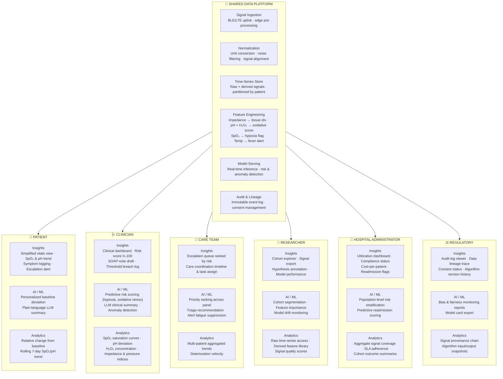

```mermaid
graph TD
    subgraph SharedPlatform["🔵 SHARED DATA PLATFORM"]
        SI["Signal Ingestion\nBLE/LTE uplink · edge pre-processing"]
        NO["Normalization\nUnit conversion · noise filtering · signal alignment"]
        TS["Time-Series Store\nRaw + derived signals · partitioned by patient"]
        FE["Feature Engineering\nImpedance → tissue idx · pH + H₂O₂ → oxidative score\nSpO₂ → hypoxia flag · Temp → fever alert"]
        MS["Model Serving\nReal-time inference · risk & anomaly detection"]
        AL["Audit & Lineage\nImmutable event log · consent management"]
    end

    subgraph Patient["👤 PATIENT"]
        P_I["Insights\nSimplified vitals view · SpO₂ & pH trend\nSymptom logging · Escalation alert"]
        P_A["AI / ML\nPersonalized baseline deviation\nPlain-language LLM summary"]
        P_M["Analytics\nRelative change from baseline\nRolling 7-day SpO₂/pH trend"]
    end

    subgraph Clinician["🩺 CLINICIAN"]
        C_I["Insights\nClinical dashboard · Risk score 0–100\nSOAP-note draft · Threshold breach log"]
        C_A["AI / ML\nPredictive risk scoring (hypoxia, oxidative stress)\nLLM clinical summary · Anomaly detection"]
        C_M["Analytics\nSpO₂ saturation curves · pH deviation\nH₂O₂ concentration · Impedance & pressure indices"]
    end

    subgraph CareTeam["👥 CARE TEAM"]
        CT_I["Insights\nEscalation queue ranked by risk\nCare coordination timeline & task assign"]
        CT_A["AI / ML\nPriority ranking across panel\nTriage recommendation · Alert fatigue suppression"]
        CT_M["Analytics\nMulti-patient aggregated trends\nDeterioration velocity"]
    end

    subgraph Researcher["🔬 RESEARCHER"]
        R_I["Insights\nCohort explorer · Signal export\nHypothesis annotation · Model performance"]
        R_A["AI / ML\nCohort segmentation · Feature importance\nModel drift monitoring"]
        R_M["Analytics\nRaw time-series access · Derived feature library\nSignal quality scores"]
    end

    subgraph Admin["🏥 HOSPITAL ADMINISTRATOR"]
        A_I["Insights\nUtilization dashboard · Compliance status\nCost-per-patient · Readmission flags"]
        A_A["AI / ML\nPopulation-level risk stratification\nPredictive readmission scoring"]
        A_M["Analytics\nAggregate signal coverage · SLA adherence\nCohort outcome summaries"]
    end

    subgraph Regulatory["⚖️ REGULATORY"]
        RG_I["Insights\nAudit log viewer · Data lineage trace\nConsent status · Algorithm version history"]
        RG_A["AI / ML\nBias & fairness monitoring reports\nModel card export"]
        RG_M["Analytics\nSignal provenance chain\nAlgorithm input/output snapshots"]
    end

    SharedPlatform --> Patient
    SharedPlatform --> Clinician
    SharedPlatform --> CareTeam
    SharedPlatform --> Researcher
    SharedPlatform --> Admin
    SharedPlatform --> Regulatory
```
