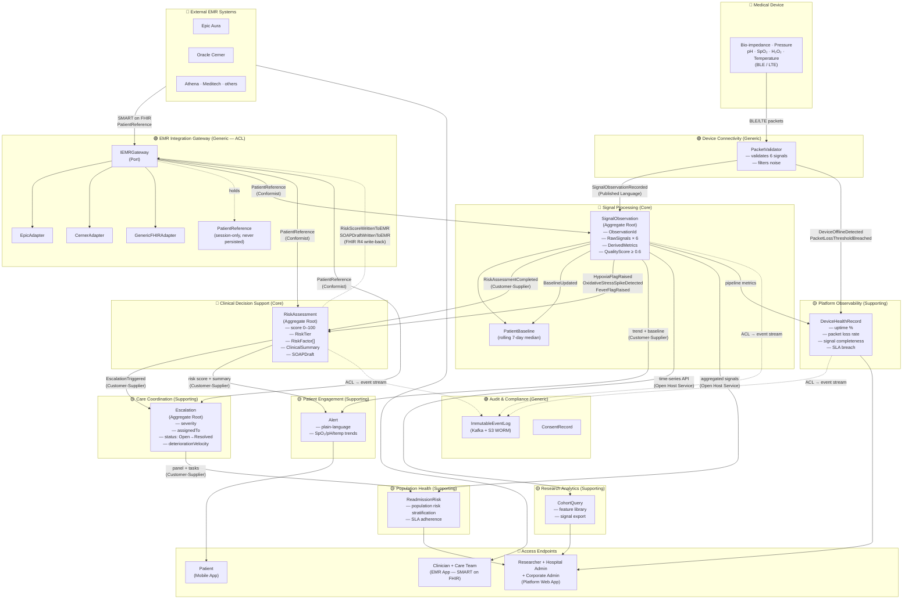
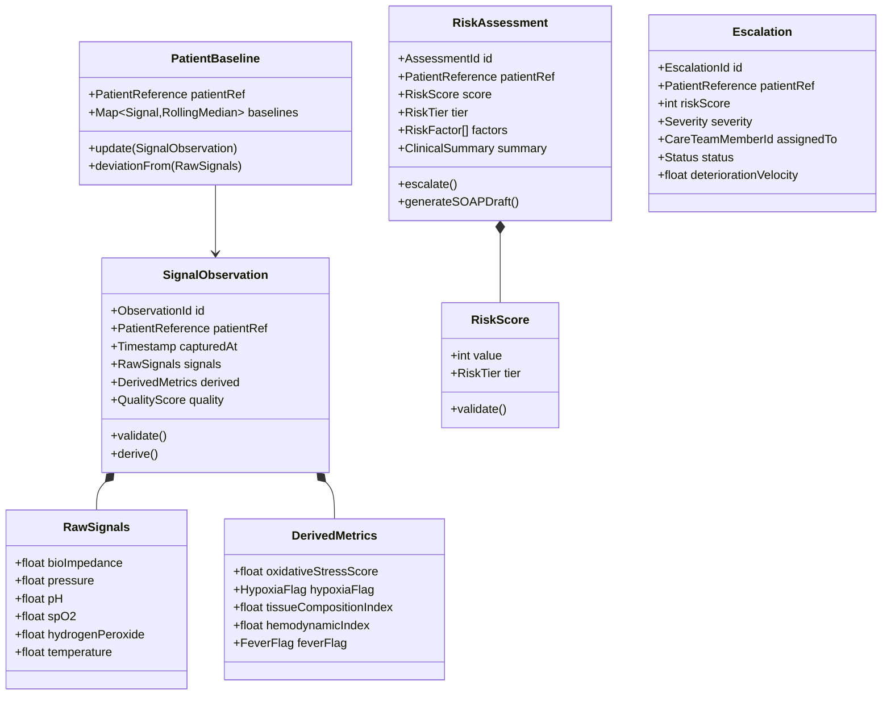
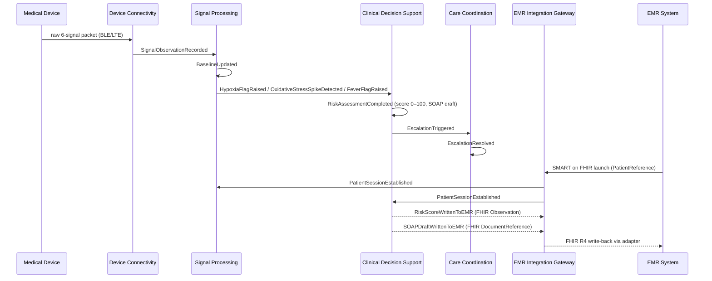

# Multi-Signal Device — Domain Model Diagram

## Full Domain Map (Bounded Contexts + Aggregates + Events)

```mermaid
graph TD

    %% ── DEVICES ──────────────────────────────────────────────────
    subgraph DEV["📡 Medical Device"]
        D1["Bio-impedance · Pressure\npH · SpO₂ · H₂O₂ · Temperature\n(BLE / LTE)"]
    end

    %% ── GENERIC SUBDOMAINS ───────────────────────────────────────
    subgraph DC["🟢 Device Connectivity (Generic)"]
        DC1["PacketValidator\n— validates 6 signals\n— filters noise"]
    end

    subgraph EMR["🟢 EMR Integration Gateway (Generic — ACL)"]
        EMR1["IEMRGateway\n(Port)"]
        EMR2["EpicAdapter"]
        EMR3["CernerAdapter"]
        EMR4["GenericFHIRAdapter"]
        EMR5["PatientReference\n(session-only, never persisted)"]
        EMR1 --> EMR2
        EMR1 --> EMR3
        EMR1 --> EMR4
        EMR1 -.->|"holds"| EMR5
    end

    subgraph AC["🟢 Audit & Compliance (Generic)"]
        AC1["ImmutableEventLog\n(Kafka + S3 WORM)"]
        AC2["ConsentRecord"]
    end

    %% ── CORE SUBDOMAINS ──────────────────────────────────────────
    subgraph SP["🔴 Signal Processing (Core)"]
        SP1["SignalObservation\n(Aggregate Root)\n— ObservationId\n— RawSignals × 6\n— DerivedMetrics\n— QualityScore ≥ 0.6"]
        SP2["PatientBaseline\n(rolling 7-day median)"]
        SP1 --> SP2
    end

    subgraph CDS["🔴 Clinical Decision Support (Core)"]
        CDS1["RiskAssessment\n(Aggregate Root)\n— score 0–100\n— RiskTier\n— RiskFactor[]\n— ClinicalSummary\n— SOAPDraft"]
    end

    %% ── SUPPORTING SUBDOMAINS ────────────────────────────────────
    subgraph CC["🟡 Care Coordination (Supporting)"]
        CC1["Escalation\n(Aggregate Root)\n— severity\n— assignedTo\n— status: Open→Resolved\n— deteriorationVelocity"]
    end

    subgraph PE["🟡 Patient Engagement (Supporting)"]
        PE1["Alert\n— plain-language\n— SpO₂/pH/temp trends"]
    end

    subgraph RA["🟡 Research Analytics (Supporting)"]
        RA1["CohortQuery\n— feature library\n— signal export"]
    end

    subgraph PH["🟡 Population Health (Supporting)"]
        PH1["ReadmissionRisk\n— population risk stratification\n— SLA adherence"]
    end

    subgraph OBS["🟡 Platform Observability (Supporting)"]
        OBS1["DeviceHealthRecord\n— uptime %\n— packet loss rate\n— signal completeness\n— SLA breach"]
    end

    %% ── EXTERNAL EMR SYSTEMS ─────────────────────────────────────
    subgraph EMRSYS["🏥 External EMR Systems"]
        E1["Epic Aura"]
        E2["Oracle Cerner"]
        E3["Athena · Meditech · others"]
    end

    %% ── ACCESS ENDPOINTS ─────────────────────────────────────────
    subgraph END["📱 Access Endpoints"]
        A1["Patient\n(Mobile App)"]
        A2["Clinician + Care Team\n(EMR App — SMART on FHIR)"]
        A3["Researcher + Hospital Admin\n+ Corporate Admin\n(Platform Web App)"]
    end

    %% ── FLOWS ────────────────────────────────────────────────────

    D1 -->|"BLE/LTE packets"| DC1

    DC1 -->|"SignalObservationRecorded\n(Published Language)"| SP1

    SP1 -->|"RiskAssessmentCompleted\n(Customer-Supplier)"| CDS1
    SP1 -->|"BaselineUpdated"| SP2
    SP1 -->|"HypoxiaFlagRaised\nOxidativeStressSpikeDetected\nFeverFlagRaised"| CDS1
    SP1 -->|"trend + baseline\n(Customer-Supplier)"| PE1
    SP1 -->|"time-series API\n(Open Host Service)"| RA1
    SP1 -->|"aggregated signals\n(Open Host Service)"| PH1
    SP1 -->|"pipeline metrics"| OBS1

    CDS1 -->|"EscalationTriggered\n(Customer-Supplier)"| CC1
    CDS1 -->|"risk score + summary\n(Customer-Supplier)"| PE1

    CC1 -->|"panel + tasks\n(Customer-Supplier)"| PH1

    DC1 -->|"DeviceOfflineDetected\nPacketLossThresholdBreached"| OBS1

    SP1 -.->|"ACL → event stream"| AC1
    CDS1 -.->|"ACL → event stream"| AC1
    OBS1 -.->|"ACL → event stream"| AC1

    %% EMR integration
    EMRSYS -->|"SMART on FHIR\nPatientReference"| EMR1
    EMR1 -->|"PatientReference\n(Conformist)"| SP1
    EMR1 -->|"PatientReference\n(Conformist)"| CDS1
    EMR1 -->|"PatientReference\n(Conformist)"| CC1
    CDS1 -.->|"RiskScoreWrittenToEMR\nSOAPDraftWrittenToEMR\n(FHIR R4 write-back)"| EMR1

    %% Endpoints
    PE1 --> A1
    EMRSYS --> A2
    RA1 --> A3
    PH1 --> A3
    OBS1 --> A3
```

## Aggregate Internals

```mermaid
classDiagram

    class SignalObservation {
        +ObservationId id
        +PatientReference patientRef
        +Timestamp capturedAt
        +RawSignals signals
        +DerivedMetrics derived
        +QualityScore quality
        +validate()
        +derive()
    }
    class RawSignals {
        +float bioImpedance
        +float pressure
        +float pH
        +float spO2
        +float hydrogenPeroxide
        +float temperature
    }
    class DerivedMetrics {
        +float oxidativeStressScore
        +HypoxiaFlag hypoxiaFlag
        +float tissueCompositionIndex
        +float hemodynamicIndex
        +FeverFlag feverFlag
    }
    class PatientBaseline {
        +PatientReference patientRef
        +Map~Signal,RollingMedian~ baselines
        +update(SignalObservation)
        +deviationFrom(RawSignals)
    }

    class RiskAssessment {
        +AssessmentId id
        +PatientReference patientRef
        +RiskScore score
        +RiskTier tier
        +RiskFactor[] factors
        +ClinicalSummary summary
        +escalate()
        +generateSOAPDraft()
    }
    class RiskScore {
        +int value
        +RiskTier tier
        +validate()
    }

    class Escalation {
        +EscalationId id
        +PatientReference patientRef
        +int riskScore
        +Severity severity
        +CareTeamMemberId assignedTo
        +Status status
        +float deteriorationVelocity
    }

    SignalObservation *-- RawSignals
    SignalObservation *-- DerivedMetrics
    PatientBaseline --> SignalObservation
    RiskAssessment *-- RiskScore
```

## Domain Events Flow

```mermaid
sequenceDiagram
    participant Dev as Medical Device
    participant DC as Device Connectivity
    participant SP as Signal Processing
    participant CDS as Clinical Decision Support
    participant CC as Care Coordination
    participant EMR as EMR Integration Gateway
    participant EMRSYS as EMR System

    Dev->>DC: raw 6-signal packet (BLE/LTE)
    DC->>SP: SignalObservationRecorded
    SP->>SP: BaselineUpdated
    SP->>CDS: HypoxiaFlagRaised / OxidativeStressSpikeDetected / FeverFlagRaised
    CDS->>CDS: RiskAssessmentCompleted (score 0–100, SOAP draft)
    CDS->>CC: EscalationTriggered
    CC->>CC: EscalationResolved

    EMRSYS->>EMR: SMART on FHIR launch (PatientReference)
    EMR->>SP: PatientSessionEstablished
    EMR->>CDS: PatientSessionEstablished
    CDS-->>EMR: RiskScoreWrittenToEMR (FHIR Observation)
    CDS-->>EMR: SOAPDraftWrittenToEMR (FHIR DocumentReference)
    EMR-->>EMRSYS: FHIR R4 write-back via adapter
```
