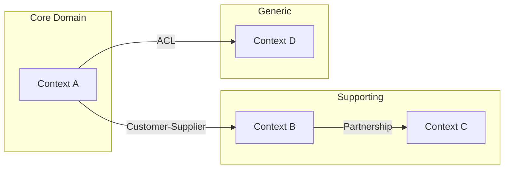
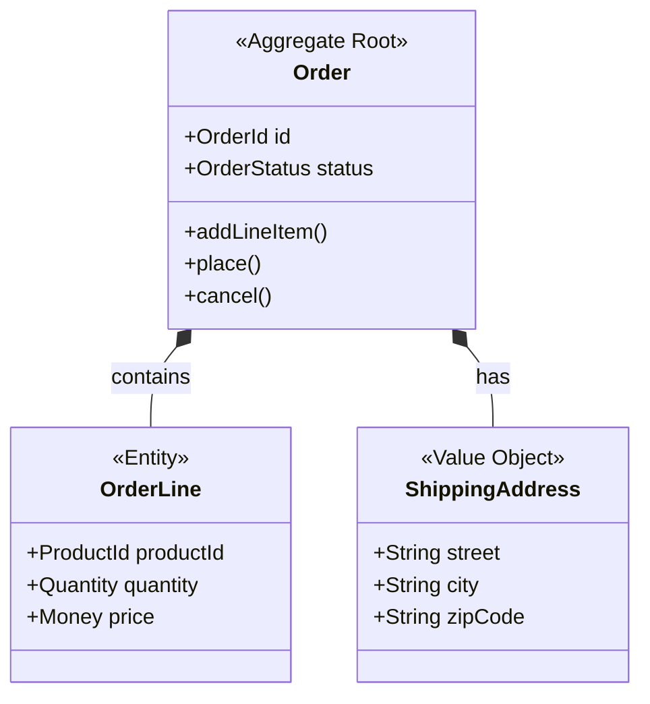
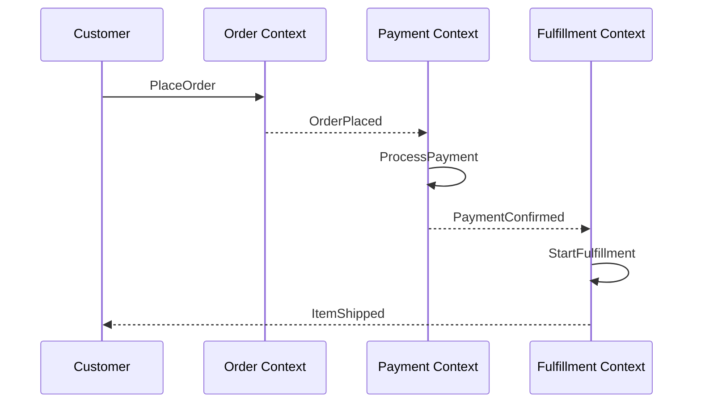

# Output Templates Reference

Templates for the artifacts the DDD Workshop skill can generate. Adapt these to the user's domain — they're starting points, not rigid formats.

## Design Document Template

Write to `domain-model/design.md` (or `domain-model/<context-name>/design.md` for multi-context systems).

```markdown
# [Domain/Context Name] — Domain Design

## Overview
Brief description of what this bounded context is responsible for and why it exists.

## Ubiquitous Language

| Term | Definition | Notes |
|------|-----------|-------|
| [Term] | [What it means in this context] | [Disambiguation, edge cases] |

## Context Map
[Mermaid diagram showing this context's relationships to other contexts]

## Aggregates

### [AggregateName] Aggregate
**Root:** [AggregateRootEntity]
**Purpose:** [What consistency boundary does this protect?]

**Entities:**
- [EntityName] — [brief description]

**Value Objects:**
- [VOName] — [brief description]

**Invariants:**
| Rule | Condition | On Violation |
|------|-----------|-------------|
| [Rule name] | [What must hold true] | [What happens if violated] |

**Domain Events Produced:**
- [EventName] — [When it fires, what data it carries]

**Repository Interface:**
- findById, save, delete, [domain-specific queries]

## Domain Events Catalog

| Event | Producer | Trigger | Payload | Consumers |
|-------|----------|---------|---------|-----------|
| [EventName] | [Aggregate] | [What causes it] | [Key data fields] | [Who listens] |

## Domain Services

| Service | Responsibility | Aggregates Involved |
|---------|---------------|-------------------|
| [ServiceName] | [What it does] | [Which aggregates it coordinates] |

## Business Rules Summary

| Rule | Enforced By | Description |
|------|------------|-------------|
| [Rule name] | [Aggregate or Service] | [Plain English description] |
```

## Code Scaffold Templates

Organize output by bounded context and layer:

```
domain-model/
└── [context-name]/
    ├── domain/
    │   ├── entities/
    │   ├── value-objects/
    │   ├── events/
    │   ├── services/
    │   └── repositories/     (interfaces only)
    ├── application/
    │   └── services/          (use case orchestration)
    └── infrastructure/
        └── repositories/      (implementations — stubs)
```

### Entity Template (TypeScript example)

```typescript
import { OrderId } from './value-objects/order-id';
import { OrderLine } from './order-line';
import { ShippingAddress } from './value-objects/shipping-address';
import { OrderPlaced } from './events/order-placed';

export class Order {
  private readonly _id: OrderId;
  private _lines: OrderLine[];
  private _shippingAddress: ShippingAddress;
  private _status: OrderStatus;
  private _domainEvents: DomainEvent[] = [];

  constructor(id: OrderId, /* ... */) {
    // Enforce invariants at creation
  }

  get id(): OrderId { return this._id; }

  addLineItem(productId: ProductId, quantity: Quantity, price: Money): void {
    // Business logic + invariant checks
    // this._domainEvents.push(new LineItemAdded(...));
  }

  place(): void {
    // Validate order can be placed
    // this._domainEvents.push(new OrderPlaced(...));
  }

  pullDomainEvents(): DomainEvent[] {
    const events = [...this._domainEvents];
    this._domainEvents = [];
    return events;
  }
}
```

### Value Object Template

```typescript
export class Money {
  constructor(
    public readonly amount: number,
    public readonly currency: string,
  ) {
    if (amount < 0) throw new Error('Money amount cannot be negative');
    if (!currency) throw new Error('Currency is required');
  }

  add(other: Money): Money {
    if (this.currency !== other.currency) {
      throw new Error('Cannot add different currencies');
    }
    return new Money(this.amount + other.amount, this.currency);
  }

  equals(other: Money): boolean {
    return this.amount === other.amount && this.currency === other.currency;
  }
}
```

### Domain Event Template

```typescript
export class OrderPlaced {
  public readonly occurredOn: Date;

  constructor(
    public readonly orderId: string,
    public readonly customerId: string,
    public readonly totalAmount: Money,
    public readonly lineItems: ReadonlyArray<{ productId: string; quantity: number }>,
  ) {
    this.occurredOn = new Date();
  }
}
```

### Repository Interface Template

```typescript
export interface OrderRepository {
  findById(id: OrderId): Promise<Order | null>;
  findByCustomerId(customerId: CustomerId): Promise<Order[]>;
  save(order: Order): Promise<void>;
  delete(id: OrderId): Promise<void>;
  nextId(): OrderId;
}
```

## Diagram Templates

### Context Map (Mermaid)



### Aggregate Boundaries (Mermaid)



### Event Flow (Mermaid)



## Adapting Templates by Language

When the user specifies a language, adapt the code scaffold:

- **Python**: Use dataclasses or Pydantic for VOs, ABC for repository interfaces, `@property` for entity accessors
- **Java**: Use records for VOs (Java 16+), interfaces for repositories, annotations for validation
- **C#**: Use records for VOs, interfaces for repositories, rich domain model with private setters
- **Go**: Use structs for entities and VOs, interfaces for repositories, constructor functions for invariant enforcement
- **Kotlin**: Use data classes for VOs, interfaces for repositories, sealed classes for domain events

Ask the user's preferred language before generating code. If they don't specify, ask.
