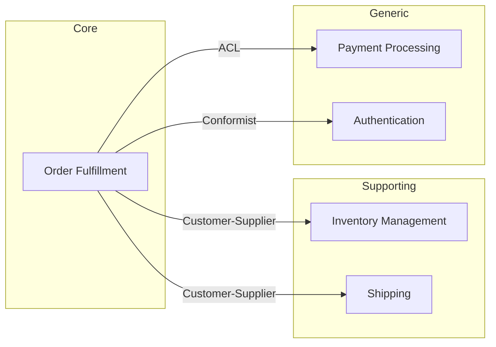

# Strategic Design Patterns Reference

Strategic design is about the big picture: how the system decomposes into bounded contexts, how those contexts relate to each other, and where to invest the most design effort.

## Subdomain Classification

Every business domain breaks down into subdomains. Classifying them helps you decide where to invest modeling effort.

### Core Domain
The thing that makes the business unique. This is where competitive advantage lives and where you should invest the most modeling effort and best engineering talent.

- Ask: "What does your business do that competitors can't easily copy?"
- Signal: This is the part people get passionate about. It's where the most complex business rules live.
- Design approach: Rich domain model, deep tactical DDD patterns.

### Supporting Subdomain
Necessary for the business but not a differentiator. Important, but simpler than the core domain.

- Ask: "What does the business need that's specific to your industry but isn't your secret sauce?"
- Signal: Custom but not complex. Wouldn't buy off-the-shelf because it's too specific, but it's not where you innovate.
- Design approach: Adequate modeling. Don't over-engineer, but don't neglect it either.

### Generic Subdomain
Solved problems. Could be bought, outsourced, or implemented with well-known patterns.

- Ask: "What parts of your system could you replace with a SaaS product or open-source library?"
- Signal: Authentication, email sending, payment processing, file storage.
- Design approach: Use existing solutions where possible. If building, keep it simple.

## Bounded Contexts

A bounded context is a linguistic and model boundary. Within a bounded context, every term has exactly one meaning, and the model is internally consistent.

### How to Find Bounded Contexts

**From language:** When the same word means different things to different people, that's a context boundary. "Product" in the catalog (description, images, categories) vs. "Product" in the warehouse (weight, dimensions, shelf location) vs. "Product" in billing (price, tax rules, discounts).

**From teams:** Conway's Law applies. If different teams own different parts, those are likely different contexts.

**From lifecycle:** If an entity goes through distinct phases with different rules (draft → submitted → approved → fulfilled), and different actors care about different phases, each phase might be its own context.

**From existing code (brownfield):** Look at module/package boundaries, shared databases, and where names diverge. A `User` class that has 47 fields is probably serving multiple contexts.

### Naming Bounded Contexts

Name them after what they DO, not what they contain:
- Good: "Order Fulfillment", "Product Catalog", "Customer Billing"
- Bad: "Order Service", "Product Module", "User Database"

## Context Mapping Patterns

These describe the relationships between bounded contexts.

### Shared Kernel
Two contexts share a small, common model. Both teams must agree on changes. Use sparingly — it creates coupling.

When to use: Contexts that are tightly related and owned by teams that collaborate closely.

### Customer-Supplier
Upstream context (supplier) provides something the downstream context (customer) needs. The upstream team can plan their work considering downstream needs.

When to use: Clear dependency direction. Upstream team is responsive to downstream needs.

### Conformist
Downstream context conforms to the upstream model as-is, with no translation. The upstream team has no motivation to accommodate downstream needs.

When to use: When integrating with a large system you can't influence (e.g., a dominant platform or legacy system you can't change).

### Anti-Corruption Layer (ACL)
Downstream context builds a translation layer to protect its model from the upstream model. Prevents foreign concepts from leaking in.

When to use: When the upstream model would pollute your domain model. Essential when integrating with legacy systems, third-party APIs, or contexts with a very different model.

### Open Host Service
Upstream context provides a well-defined protocol/API for downstream consumers. One API serves many consumers.

When to use: When a context has multiple consumers. The API becomes a published interface.

### Published Language
A shared language (schema, format) for communication between contexts. Often paired with Open Host Service.

When to use: When contexts exchange data and need a common format. Think: domain events schema, API contracts, message formats.

### Separate Ways
No integration. Each context solves the problem independently.

When to use: When integration cost exceeds the benefit. Sometimes duplication is cheaper than coordination.

### Partnership
Two contexts evolve together. Both teams coordinate releases and changes, neither dominates.

When to use: Contexts that are co-developed and need to stay in sync. Requires good team communication.

## Context Map Visualization

Present context maps as a diagram showing:
- Each bounded context as a box with its name and subdomain classification
- Lines between contexts labeled with the relationship pattern
- Direction arrows for upstream/downstream relationships

Use Mermaid format:

## Ubiquitous Language

For each bounded context, maintain a glossary:

| Term | Definition (in this context) | Notes |
|------|------------------------------|-------|
| Order | A confirmed purchase request with line items and shipping info | Different from "order" in warehouse (pick list) |
| Customer | The person who placed the order | In billing, "Customer" is the billing entity which may be a company |

Flag **polysemous terms** — words that appear in multiple contexts with different meanings. These are critical signals that context boundaries are real and important.
