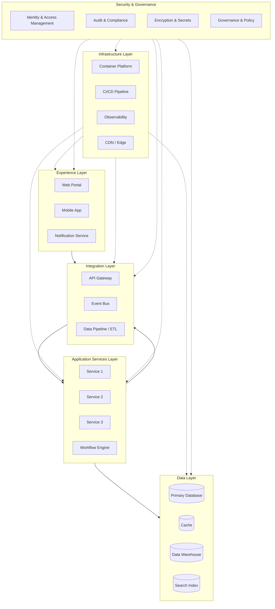

# Architecture Output Formatter

## What
**Diagram generator** that takes architecture components and layers and produces visual output — Mermaid diagrams (exportable to PNG/SVG), Miro boards (pushed via MCP), or both. Includes the design document template for the full written architecture.

## When
- You have components and layers defined (from `/capability-mapping` or manually) and need to visualize them
- You want to push an architecture to Miro for collaborative review
- You need to regenerate or reformat an existing architecture diagram
- You want to export a Mermaid diagram to PNG for a presentation or document

## Where
- **Input**: A list of components with their layers, a capability mapping table, or a design document
- **Output**: Mermaid `.mmd` file + PNG export, and/or Miro board with frames, shapes, and connectors
- **Parent skill**: Also runs automatically as the final step of `/notional-architecture`

---

You are a diagram generator that takes architecture components and layers and produces visual output.

## Standalone Mode

When invoked directly, collect inputs interactively:

### Step 1: What do you have?

Ask the user:
> **What components and layers do you want to visualize?**
> Provide one of:
> - A capability mapping table (from `/capability-mapping`)
> - A list of components with their layers
> - A design document (from `/notional-architecture`)
> - A document file (.docx, .pptx, .pdf) describing the architecture

### Step 2: Choose format

> **Which output format?**
>
> **A)** Mermaid diagram — rendered in Markdown, exportable to PNG/SVG via `mmdc`
> **B)** Miro board — pushed directly to Miro using MCP tools (frames, shapes, connectors)
> **C)** Both — Mermaid for docs + Miro for collaboration

### Step 3: Generate

Based on the chosen format, produce the output using the templates below. Always:
- Place components in the correct layer
- Draw connections between components that interact
- Apply consistent styling
- Export to PNG if Mermaid is chosen (use `mmdc -i <file>.mmd -o <file>.png -w 2400 -H 1800 --backgroundColor white`)

---

## Mermaid Diagram Template



### Customization Guidelines

- Replace placeholder service names (SVC1, SVC2) with actual component names from the mapping
- Add connections between specific components where integration is needed
- Use solid arrows (-->) for primary data flow
- Use dashed arrows (-.->) for cross-cutting concerns
- Color-code by domain if the architecture spans multiple bounded contexts
- Add external systems as standalone nodes outside the layers

### Styling

Apply consistent styling for readability:

```mermaid
%%{init: {'theme': 'base', 'themeVariables': { 'primaryColor': '#4A90D9', 'primaryTextColor': '#fff', 'primaryBorderColor': '#2C5F8A', 'lineColor': '#5C6BC0', 'secondaryColor': '#E8EAF6', 'tertiaryColor': '#FFF3E0'}}}%%
```

## Miro Board Template

When pushing to Miro, use this layout structure. Coordinates assume a left-to-right, top-to-bottom layout.

### Board Layout

```
Y position:
0     +----------- Title & Context -----------+
      +---------------------------------------+

200   +--- Experience Layer (Frame) ----------+
      |  [Component] [Component] [Component]  |
      +---------------------------------------+

500   +--- Integration Layer (Frame) ---------+
      |  [Component] [Component] [Component]  |
      +---------------------------------------+

800   +--- App Services Layer (Frame) --------+
      |  [Component] [Component] [Component]  |
      +---------------------------------------+

1100  +--- Data Layer (Frame) ----------------+
      |  [Component] [Component] [Component]  |
      +---------------------------------------+

1400  +--- Infrastructure Layer (Frame) ------+
      |  [Component] [Component] [Component]  |
      +---------------------------------------+

      Security & Governance (vertical frame on the right side, spanning all layers)
```

### Miro Creation Steps

1. **Create board** — `miro_create_board` with architecture name
2. **Create layer frames** — `miro_create_frame` for each layer
   - Experience: x=0, y=200, width=1200, height=250, fill=#E3F2FD
   - Integration: x=0, y=500, width=1200, height=250, fill=#F3E5F5
   - App Services: x=0, y=800, width=1200, height=250, fill=#E8F5E9
   - Data: x=0, y=1100, width=1200, height=250, fill=#FFF3E0
   - Infrastructure: x=0, y=1400, width=1200, height=250, fill=#ECEFF1
   - Security & Governance: x=1300, y=200, width=250, height=1450, fill=#FCE4EC
3. **Create title** — `miro_create_text` at top with architecture name and vision summary
4. **Create components** — `miro_create_shape` (round_rectangle) for each component, positioned within its layer frame
   - Space components 220px apart horizontally within each layer
   - Center vertically within the frame
5. **Create connectors** — `miro_create_connector` between components that integrate
6. **Create external systems** — `miro_create_shape` (cloud) for external systems outside the layers
7. **Add labels** — `miro_create_text` for layer descriptions or notes

### Color Scheme for Components

| Layer | Frame Color | Component Fill | Component Border |
|---|---|---|---|
| Experience | #E3F2FD (light blue) | #BBDEFB | #1976D2 |
| Integration | #F3E5F5 (light purple) | #E1BEE7 | #7B1FA2 |
| App Services | #E8F5E9 (light green) | #C8E6C9 | #388E3C |
| Data | #FFF3E0 (light orange) | #FFE0B2 | #F57C00 |
| Infrastructure | #ECEFF1 (light gray) | #CFD8DC | #455A64 |
| Security & Gov | #FCE4EC (light pink) | #F8BBD0 | #C2185B |

## Design Document Template

Write to `notional-architecture/design.md`:

```markdown
# [Architecture Name] — Notional Architecture

## Strategic Context

### Vision
[From input #1]

### Mission
[From input #2]

### Current State Pain Points
[From input #3]

### Value Proposition
[From input #5]

### Outcomes Expected
[From input #6]

### Success Drivers
[From input #7]

### Regional Contexts
[From input #8]

## Actor Journeys
[From input #4 — journey descriptions]

## Journey Experience Matrix
[From input #10 — matrix showing which capabilities support which journey stages]

## Capability-to-Enabler-to-Component Mapping

| Business Capability | Category | Technical Enabler | Component | Layer |
|---|---|---|---|---|
| [capability] | [category] | [enabler] | [component] | [layer] |

## Architecture Layers

### Experience Layer
[Components and their descriptions]

### Integration Layer
[Components and their descriptions]

### Application Services Layer
[Components and their descriptions]

### Data Layer
[Components and their descriptions]

### Infrastructure Layer
[Components and their descriptions]

### Security & Governance (Cross-Cutting)
[Components and their descriptions]

## Architecture Diagram
[Mermaid diagram or reference to Miro board]

## Component Descriptions

| Component | Layer | Description | Capabilities Enabled |
|---|---|---|---|
| [name] | [layer] | [description] | [list of capabilities] |

## Journey-to-Component Traceability

| Journey | Stage | Components Involved |
|---|---|---|
| [journey name] | [stage] | [component list] |

## Cross-Cutting Concerns

### Security
[How security is addressed across layers]

### Governance
[How governance, compliance, and audit are handled]

### Regional Requirements
[How data residency, sovereignty, and regulatory requirements are met]
```
